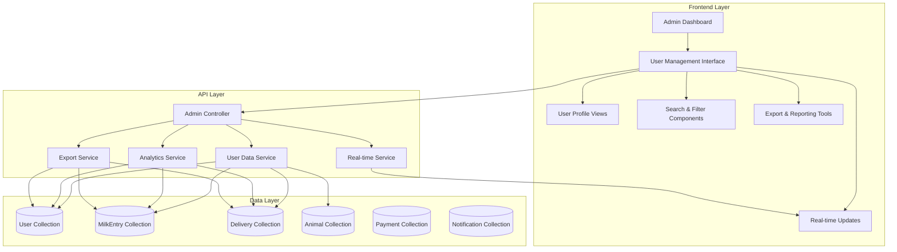

# Design Document: Admin Comprehensive Data Access

## Overview

This design implements a comprehensive admin data access system that provides complete visibility into all farmers, buyers, and employee data. The system extends the existing admin functionality to match and exceed the data access capabilities currently available to employees, while adding enhanced administrative controls, real-time updates, and advanced analytics.

The design leverages the existing MongoDB data models and Express.js API structure, extending the current admin controller and service layer to provide unified access to all user data with role-specific information views.

## Architecture

### System Components



### Data Flow Architecture

1. **Request Processing**: Admin requests flow through authentication middleware to admin controllers
2. **Data Aggregation**: Controllers aggregate data from multiple collections based on user roles
3. **Real-time Updates**: WebSocket connections provide live data updates
4. **Export Processing**: Asynchronous export generation with progress tracking
5. **Security Layer**: Role-based access control with audit logging

## Components and Interfaces

### Backend API Extensions

#### Enhanced Admin Controller Methods

```javascript
// Extended admin.controller.js methods
export const getComprehensiveUserData = asyncHandler(async (req, res) => {
  // Comprehensive user data with role-specific information
});

export const getUserProfile = asyncHandler(async (req, res) => {
  // Detailed user profile with activities and transactions
});

export const getUserActivities = asyncHandler(async (req, res) => {
  // User activity timeline and analytics
});

export const exportUserData = asyncHandler(async (req, res) => {
  // Data export with multiple format support
});

export const getUserAnalytics = asyncHandler(async (req, res) => {
  // User behavior analytics and insights
});
```

#### New Service Layer Components

```javascript
// userDataService.js
class UserDataService {
  async getComprehensiveUserList(filters, pagination)
  async getUserProfileData(userId, includeActivities)
  async getUserActivityTimeline(userId, dateRange)
  async generateUserAnalytics(filters)
  async exportUserData(filters, format)
}

// analyticsService.js
class AnalyticsService {
  async getUserEngagementMetrics(dateRange)
  async getSystemUsageStatistics()
  async generateTrendAnalysis(metric, period)
}

// exportService.js
class ExportService {
  async generateCSVExport(data, fields)
  async generateExcelExport(data, fields)
  async generatePDFReport(data, template)
}
```

### Frontend Components

#### Enhanced User Management Interface

```jsx
// ComprehensiveUserManagement.jsx
const ComprehensiveUserManagement = () => {
  // Unified interface for all user types
  // Advanced search and filtering
  // Bulk operations support
  // Real-time data updates
};

// UserProfileModal.jsx
const UserProfileModal = ({ userId, userType }) => {
  // Role-specific profile views
  // Activity timelines
  // Transaction history
  // Quick actions
};

// UserAnalyticsDashboard.jsx
const UserAnalyticsDashboard = () => {
  // User engagement metrics
  // System usage statistics
  // Trend visualizations
};
```

#### Real-time Update Components

```jsx
// useRealTimeUserData.js
const useRealTimeUserData = (filters) => {
  // WebSocket connection for live updates
  // Automatic data synchronization
  // Event-driven state management
};
```

## Data Models

### Extended User Data Aggregation

The system aggregates data from multiple collections to provide comprehensive user profiles:

```javascript
// User Profile Data Structure
const userProfileData = {
  // Basic user information
  user: {
    _id: ObjectId,
    uniqueId: String,
    username: String,
    email: String,
    mobile: String,
    role: String,
    approved: Boolean,
    createdAt: Date,
    lastLoginAt: Date
  },
  
  // Role-specific data
  roleSpecificData: {
    // For farmers
    farmer: {
      milkEntries: [MilkEntry],
      animals: [Animal],
      totalMilkProduced: Number,
      totalEarnings: Number,
      averageDaily: Number,
      lastEntryDate: Date
    },
    
    // For buyers
    buyer: {
      orders: [Delivery],
      totalOrders: Number,
      totalSpent: Number,
      averageOrderValue: Number,
      lastOrderDate: Date,
      deliveryAddresses: [String]
    },
    
    // For employees
    employee: {
      milkCollections: [MilkEntry],
      deliveriesHandled: [Delivery],
      totalCollections: Number,
      totalDeliveries: Number,
      lastActivityDate: Date
    }
  },
  
  // Activity timeline
  activities: [{
    type: String, // 'milk_entry', 'order', 'payment', etc.
    date: Date,
    description: String,
    amount: Number,
    status: String
  }],
  
  // Analytics data
  analytics: {
    engagementScore: Number,
    activityTrend: String, // 'increasing', 'stable', 'decreasing'
    lastActiveDate: Date,
    totalTransactions: Number,
    averageTransactionValue: Number
  }
};
```

### Search and Filter Data Structure

```javascript
const searchFilters = {
  // Basic filters
  role: ['farmer', 'buyer', 'employee'],
  approved: Boolean,
  dateRange: {
    start: Date,
    end: Date
  },
  
  // Advanced filters
  activityLevel: ['high', 'medium', 'low', 'inactive'],
  transactionRange: {
    min: Number,
    max: Number
  },
  location: String,
  
  // Search terms
  searchTerm: String, // searches across name, ID, mobile, email
  
  // Sorting
  sortBy: String,
  sortOrder: 'asc' | 'desc',
  
  // Pagination
  page: Number,
  limit: Number
};
```

## Correctness Properties

Now I need to analyze the acceptance criteria for testability using the prework tool:

*A property is a characteristic or behavior that should hold true across all valid executions of a system—essentially, a formal statement about what the system should do. Properties serve as the bridge between human-readable specifications and machine-verifiable correctness guarantees.*

### Core System Properties

**Property 1: Comprehensive User Data Display**
*For any* user in the system, when an admin views their profile, the displayed information should include all role-specific data (milk entries and animals for farmers, orders and payments for buyers, collections and deliveries for employees) along with complete profile information
**Validates: Requirements 1.2, 3.2, 3.3, 3.4**

**Property 2: Employee Data Access Parity**
*For any* data accessible to employees, the same data should be accessible to admins with equal or greater detail and functionality
**Validates: Requirements 1.3**

**Property 3: Data Consistency Across Interfaces**
*For any* user record, the same user information should be displayed consistently across all admin interface views (list view, profile view, search results, etc.)
**Validates: Requirements 1.4, 1.5**

**Property 4: Comprehensive Search and Filter Functionality**
*For any* search term or filter criteria (name, unique ID, mobile, email, role, approval status, user type, registration date, activity level), the system should return only users that match the specified criteria, and combining multiple criteria should return users matching all conditions
**Validates: Requirements 2.1, 2.2, 2.3, 2.4**

**Property 5: Filter Reset Round-trip**
*For any* set of applied filters, clearing all filters should return the system to the default state showing all users with default sorting
**Validates: Requirements 2.5**

**Property 6: Comprehensive Export Functionality**
*For any* user data set and export format (CSV, Excel, PDF), the exported file should contain all selected data fields within the specified date range and respect any applied filters
**Validates: Requirements 4.1, 4.2, 4.3**

**Property 7: Asynchronous Export Processing**
*For any* large export operation, the system should provide progress indicators and complete the export asynchronously while maintaining export history and providing download links
**Validates: Requirements 4.4, 4.5**

**Property 8: Real-time Data Synchronization**
*For any* user data change (new registration, activity, profile update), the change should be immediately visible in all admin interfaces without requiring manual refresh
**Validates: Requirements 5.1, 5.2, 5.3, 5.4, 5.5**

**Property 9: Administrative Action Availability**
*For any* user account, all specified administrative actions (approve, reject, suspend, reactivate) should be available and functional based on the user's current status
**Validates: Requirements 6.1**

**Property 10: Bulk Operations Functionality**
*For any* selection of multiple users, batch operations should execute successfully on all selected users and provide appropriate feedback
**Validates: Requirements 6.3**

**Property 11: Comprehensive Audit Logging**
*For any* administrative action or sensitive data access, the system should create audit log entries containing timestamps, admin identification, action details, and affected user information
**Validates: Requirements 6.2, 6.5, 8.2, 8.4**

**Property 12: Comprehensive Analytics and Monitoring**
*For any* user or system metric, the admin interface should provide activity timelines, usage statistics, engagement metrics, performance indicators, and graphical trend representations
**Validates: Requirements 7.1, 7.2, 7.3, 7.4**

**Property 13: Anomaly Detection and Highlighting**
*For any* unusual user activity pattern or suspicious behavior, the system should identify and highlight these anomalies in the admin interface
**Validates: Requirements 7.5**

**Property 14: Security and Access Control**
*For any* admin user, access to user data should be granted only after proper authentication and authorization verification, and access should be limited based on admin privilege levels
**Validates: Requirements 8.1, 8.5**

## Error Handling

### Data Access Errors
- **Database Connection Failures**: Graceful degradation with cached data and retry mechanisms
- **Large Dataset Timeouts**: Pagination and streaming for large data sets
- **Concurrent Access Conflicts**: Optimistic locking and conflict resolution

### Export Processing Errors
- **Export Generation Failures**: Error logging and user notification with retry options
- **File Size Limitations**: Automatic chunking for large exports
- **Format Conversion Errors**: Fallback to alternative formats with user notification

### Real-time Update Errors
- **WebSocket Connection Failures**: Automatic reconnection with exponential backoff
- **Data Synchronization Conflicts**: Conflict resolution with user notification
- **Network Interruptions**: Offline mode with data queuing for sync when reconnected

### Security and Authorization Errors
- **Unauthorized Access Attempts**: Immediate blocking with audit logging and admin notification
- **Session Expiration**: Graceful session renewal with minimal user disruption
- **Data Breach Detection**: Automatic security protocols and incident logging

## Testing Strategy

### Unit Testing Approach
- **Component Testing**: Individual React components for user interfaces
- **Service Testing**: Backend services for data aggregation and processing
- **API Endpoint Testing**: All admin controller methods with various input scenarios
- **Database Query Testing**: Complex aggregation queries for performance and accuracy

### Property-Based Testing Configuration
- **Testing Framework**: Use Jest with fast-check for JavaScript property-based testing
- **Test Iterations**: Minimum 100 iterations per property test for comprehensive coverage
- **Data Generation**: Smart generators for realistic user data, activities, and system states
- **Test Environment**: Isolated test database with comprehensive seed data

### Integration Testing
- **End-to-End Workflows**: Complete admin workflows from login to data export
- **Real-time Update Testing**: WebSocket functionality and data synchronization
- **Cross-browser Compatibility**: Admin interface functionality across different browsers
- **Performance Testing**: Large dataset handling and export generation under load

### Security Testing
- **Authentication Testing**: Admin login and session management
- **Authorization Testing**: Role-based access control verification
- **Audit Trail Testing**: Comprehensive logging and audit trail generation
- **Data Privacy Testing**: Sensitive data handling and protection measures

Each property test must be tagged with: **Feature: admin-comprehensive-data-access, Property {number}: {property_text}**

The testing strategy ensures both specific examples through unit tests and universal correctness through property-based tests, providing comprehensive validation of the admin data access system.