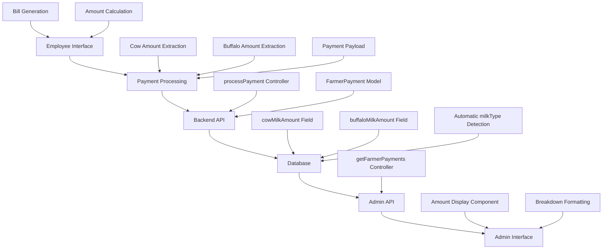

# Cow and Buffalo Amount Display - Design Document

## Overview

This design document outlines the implementation for displaying cow and buffalo milk amounts alongside the total amount in the admin farmer payments interface. The system will show a breakdown of payment amounts by milk type while maintaining the total amount display, all within the same table cell.

## Architecture

### System Components



### Data Flow

1. **Bill Generation**: Employee generates farmer bill with cow/buffalo breakdown
2. **Amount Extraction**: System extracts individual milk type amounts from bill data
3. **Payment Processing**: Employee processes payment with breakdown amounts
4. **Data Storage**: Backend stores total amount and breakdown amounts
5. **Admin Display**: Admin interface shows formatted breakdown in same table cell

## Components and Interfaces

### Backend Components

#### FarmerPayment Model
```javascript
// Enhanced model with automatic milk type detection
const farmerPaymentSchema = new mongoose.Schema({
  // Existing fields...
  amount: Number,           // Total payment amount
  cowMilkAmount: Number,    // Cow milk portion (default: 0)
  buffaloMilkAmount: Number, // Buffalo milk portion (default: 0)
  milkType: String,         // Auto-determined: 'cow', 'buffalo', 'mixed'
  // Other fields...
});

// Pre-save hook for automatic milk type detection
farmerPaymentSchema.pre('save', function(next) {
  // Auto-determine milk type based on amounts
  if (this.cowMilkAmount > 0 && this.buffaloMilkAmount > 0) {
    this.milkType = 'mixed';
  } else if (this.cowMilkAmount > 0) {
    this.milkType = 'cow';
  } else if (this.buffaloMilkAmount > 0) {
    this.milkType = 'buffalo';
  }
  next();
});
```

#### Employee Controller - processPayment
```javascript
export const processPayment = asyncHandler(async (req, res) => {
  const { 
    farmerId, 
    amount, 
    cowMilkAmount = 0,      // Cow milk amount from bill
    buffaloMilkAmount = 0,  // Buffalo milk amount from bill
    paymentType, 
    notes, 
    billPeriod 
  } = req.body;

  // Create payment with breakdown amounts
  const payment = new FarmerPayment({
    farmer: farmerId,
    amount: parseFloat(amount),
    cowMilkAmount: parseFloat(cowMilkAmount),
    buffaloMilkAmount: parseFloat(buffaloMilkAmount),
    // milkType will be auto-determined by pre-save hook
    paymentType,
    notes,
    billPeriod,
    processedBy: req.user.id,
    status: 'completed'
  });

  await payment.save();
  // Return payment with breakdown data
});
```

### Frontend Components

#### Employee Interface - Payment Processing
```javascript
// GenerateReports.jsx - processPayment function
const processPayment = async () => {
  // Extract cow and buffalo amounts from farmer bill data
  const farmer = reportData?.farmers?.find(f => f.farmerId === paymentData.farmerId) || 
                reportData?.farmer;
  
  let cowMilkAmount = 0;
  let buffaloMilkAmount = 0;
  
  if (farmer) {
    cowMilkAmount = farmer.cowMilk?.amount || 0;
    buffaloMilkAmount = farmer.buffaloMilk?.amount || 0;
  }

  const paymentPayload = {
    farmerId: paymentData.farmerId,
    amount: paymentData.totalAmount,
    cowMilkAmount: cowMilkAmount,        // Send cow amount
    buffaloMilkAmount: buffaloMilkAmount, // Send buffalo amount
    paymentType: paymentData.paymentType,
    notes: paymentData.notes,
    billPeriod: {
      dateFrom: filters.dateFrom,
      dateTo: filters.dateTo
    },
    status: 'completed'
  };

  await EmployeeService.processPayment(paymentPayload);
};
```

#### Admin Interface - Amount Display Component
```javascript
// FarmerPayments.jsx - Amount column display
<td className="px-6 py-4 whitespace-nowrap">
  <div className="space-y-1">
    {/* Total Amount - Prominent Display */}
    <div className="text-sm font-bold text-gray-900">
      Total: ₹{payment.amount.toLocaleString()}
    </div>
    
    {/* Breakdown Amounts - Individual amounts */}
    <div className="flex flex-col gap-1 text-xs">
      {payment.cowMilkAmount > 0 && (
        <div className="flex items-center gap-1">
          <span className="text-blue-600">🐄</span>
          <span className="font-medium text-blue-700">
            Cow: ₹{payment.cowMilkAmount.toLocaleString()}
          </span>
        </div>
      )}
      {payment.buffaloMilkAmount > 0 && (
        <div className="flex items-center gap-1">
          <span className="text-orange-600">🐃</span>
          <span className="font-medium text-orange-700">
            Buffalo: ₹{payment.buffaloMilkAmount.toLocaleString()}
          </span>
        </div>
      )}
      {(!payment.cowMilkAmount || payment.cowMilkAmount === 0) && 
       (!payment.buffaloMilkAmount || payment.buffaloMilkAmount === 0) && (
        <div className="text-gray-500 italic text-xs">
          No breakdown available
        </div>
      )}
    </div>
  </div>
</td>
```

## Data Models

### Payment Data Structure
```javascript
{
  _id: "payment_id",
  farmer: "farmer_object_id",
  farmerName: "John Doe",
  farmerMobile: "9876543210",
  amount: 1500,                    // Total payment amount
  cowMilkAmount: 800,              // Cow milk portion
  buffaloMilkAmount: 700,          // Buffalo milk portion
  milkType: "mixed",               // Auto-determined
  paymentType: "cash",
  paymentDate: "2024-01-15",
  processedBy: "employee_id",
  status: "completed",
  referenceNumber: "FP20240115001",
  billPeriod: {
    dateFrom: "2024-01-01",
    dateTo: "2024-01-15"
  },
  notes: "Payment for mixed milk supply"
}
```

### Bill Data Structure (Source for Amounts)
```javascript
{
  farmer: {
    farmerId: "farmer_id",
    farmerName: "John Doe",
    totalAmount: 1500,
    cowMilk: {
      quantity: 20.5,
      amount: 800,                 // Source for cowMilkAmount
      avgFat: 4.2,
      avgRate: 39.02
    },
    buffaloMilk: {
      quantity: 15.0,
      amount: 700,                 // Source for buffaloMilkAmount
      avgFat: 6.8,
      avgRate: 46.67
    }
  }
}
```

## Correctness Properties

*A property is a characteristic or behavior that should hold true across all valid executions of a system-essentially, a formal statement about what the system should do. Properties serve as the bridge between human-readable specifications and machine-verifiable correctness guarantees.*

### Property 1: Amount Consistency
*For any* payment record, the sum of cowMilkAmount and buffaloMilkAmount should equal the total amount when both are greater than zero.
**Validates: Requirements FR1, AC1**

### Property 2: Display Completeness  
*For any* payment with non-zero cow or buffalo amounts, the admin interface should display the individual amounts alongside the total amount.
**Validates: Requirements FR1, AC2**

### Property 3: Milk Type Accuracy
*For any* payment record, the milkType field should correctly reflect the presence of cow and/or buffalo amounts (cow, buffalo, or mixed).
**Validates: Requirements FR2, TR1**

### Property 4: Data Persistence
*For any* payment processed through the employee interface, the cow and buffalo amounts should be correctly stored and retrievable through the admin interface.
**Validates: Requirements FR3, AC3**

### Property 5: Backward Compatibility
*For any* existing payment without breakdown amounts, the admin interface should display the total amount without errors and show "No breakdown available".
**Validates: Requirements FR4, AC4**

## Error Handling

### Data Validation
- **Missing Amounts**: Default to 0 for cowMilkAmount and buffaloMilkAmount
- **Invalid Amounts**: Validate that amounts are non-negative numbers
- **Inconsistent Totals**: Log warnings if breakdown doesn't match total (but don't block)

### Display Fallbacks
- **Missing Breakdown Data**: Show "No breakdown available" message
- **Zero Amounts**: Hide individual amount displays, show only total
- **API Errors**: Graceful degradation to show available data

### Legacy Data Handling
- **Existing Payments**: Display total amount normally without breakdown
- **Null Values**: Treat as zero and hide individual displays
- **Migration**: No database migration required, new fields default to 0

## Testing Strategy

### Unit Tests
- **Payment Processing**: Verify cow/buffalo amounts are extracted correctly from bill data
- **Amount Display**: Test display logic with various amount combinations
- **Data Validation**: Test handling of edge cases and invalid data
- **Milk Type Detection**: Verify automatic milk type assignment

### Property-Based Tests
- **Amount Consistency**: Generate random payment data and verify amount relationships
- **Display Rendering**: Test display component with various payment scenarios
- **Data Flow**: Verify end-to-end data flow from employee to admin interface

### Integration Tests
- **Complete Flow**: Test full payment processing and display cycle
- **Real-time Updates**: Verify admin interface updates with breakdown amounts
- **Cross-browser**: Test display formatting across different browsers

### Test Scenarios
1. **Mixed Milk Payment**: Both cow and buffalo amounts > 0
2. **Cow Only Payment**: Only cow amount > 0, buffalo = 0
3. **Buffalo Only Payment**: Only buffalo amount > 0, cow = 0
4. **Legacy Payment**: Both amounts = 0 or undefined
5. **Large Numbers**: Test currency formatting with large amounts
6. **Real-time Update**: Process payment and verify immediate admin display

## Implementation Notes

### Performance Considerations
- **Database Queries**: No additional queries needed, amounts included in existing payment fetch
- **Display Rendering**: Minimal impact, simple conditional rendering
- **Real-time Updates**: Breakdown amounts included in existing polling mechanism

### Browser Compatibility
- **Currency Formatting**: Use `toLocaleString()` for consistent number formatting
- **Emoji Support**: Cow 🐄 and buffalo 🐃 emojis supported in modern browsers
- **Responsive Design**: Display adapts to different screen sizes

### Maintenance
- **Debug Logging**: Temporary console.log statements for verification (to be removed)
- **Code Documentation**: Clear comments explaining amount extraction logic
- **Error Monitoring**: Log any amount calculation discrepancies for investigation

## Deployment Considerations

### Database Changes
- **No Migration Required**: New fields have default values, existing data unaffected
- **Backward Compatibility**: System works with existing payment records

### Frontend Updates
- **Component Updates**: Modified display logic in admin interface
- **No Breaking Changes**: Existing functionality preserved

### Testing Checklist
1. ✅ Process new payment with mixed milk
2. ✅ Verify admin display shows breakdown amounts
3. ✅ Test cow-only and buffalo-only scenarios
4. ✅ Confirm legacy payments display correctly
5. ✅ Verify real-time updates include breakdown data
6. ✅ Remove debug logging after verification

## Success Criteria

The implementation will be considered successful when:

1. **Accurate Display**: Admin interface shows total amount plus individual cow/buffalo amounts
2. **Consistent Formatting**: All amounts use proper currency formatting (₹X,XXX)
3. **Proper Handling**: System gracefully handles all scenarios (mixed, single type, legacy)
4. **Real-time Updates**: New payments immediately show breakdown amounts in admin interface
5. **No Regressions**: Existing functionality continues to work without issues

The enhanced amount display will provide administrators with detailed visibility into payment composition while maintaining the clean, single-row display format.