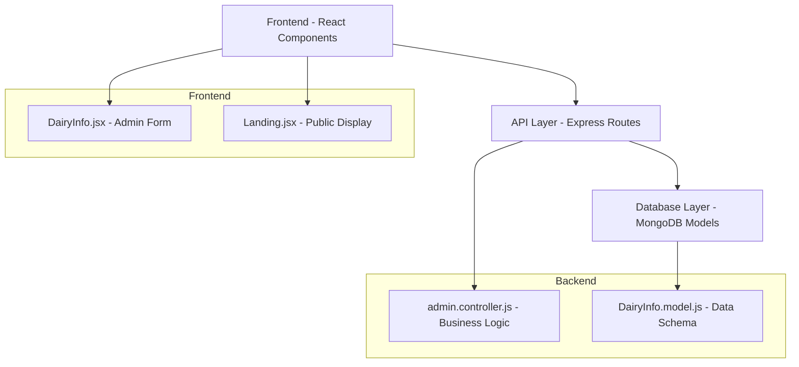

# Design Document: Dairy Info Enhancements

## Overview

This design document outlines the implementation approach for enhancing the dairy information management system with email field support, improved landing page dairy name display, and landing page text cleanup. The solution involves database schema updates, API enhancements, and frontend modifications while maintaining backward compatibility.

## Architecture

The enhancement follows the existing three-tier architecture:



## Components and Interfaces

### Database Schema Enhancement

**DairyInfo Model Extension:**
```javascript
// New field addition to existing schema
email: {
  type: String,
  required: false,  // Optional for backward compatibility
  trim: true,
  validate: {
    validator: function(v) {
      return !v || /^[^\s@]+@[^\s@]+\.[^\s@]+$/.test(v);
    },
    message: 'Please enter a valid email address'
  }
}
```

### API Layer Enhancements

**Controller Method Updates:**
- `getDairyInfo()`: Include email field in response
- `updateDairyInfo()`: Accept and validate email field
- `getLandingStats()`: Ensure dairy name is properly formatted

**Validation Logic:**
```javascript
// Email validation in updateDairyInfo
if (email && !/^[^\s@]+@[^\s@]+\.[^\s@]+$/.test(email)) {
  return res.status(400).json({
    success: false,
    error: {
      code: "INVALID_EMAIL",
      message: "Please enter a valid email address"
    }
  });
}
```

### Frontend Component Updates

**DairyInfo.jsx Enhancements:**
- Add email input field to the form grid
- Include email in state management
- Add email validation feedback
- Update form submission to include email

**Landing.jsx Improvements:**
- Ensure dairy name displays correctly from API data
- Remove "Ready to use modernize your dairy?" text
- Maintain responsive design and styling

## Data Models

### Updated DairyInfo Schema

```javascript
{
  dairyName: String (required),
  district: String (required),
  taluka: String (required),
  post: String (required),
  pincode: String (required),
  place: String (required),
  area: String (required),
  mobileNo: String (required),
  email: String (optional, validated),  // NEW FIELD
  openingTime: String (default: "06:00"),
  closingTime: String (default: "18:00"),
  timestamps: true
}
```

### API Response Format

```javascript
// GET /api/admin/dairy-info response
{
  success: true,
  data: {
    _id: "...",
    dairyName: "Green Valley Dairy",
    district: "Pune",
    // ... other fields
    email: "contact@greenvalley.com",  // NEW FIELD
    createdAt: "...",
    updatedAt: "..."
  },
  message: "Dairy information retrieved successfully"
}
```

## Correctness Properties

*A property is a characteristic or behavior that should hold true across all valid executions of a system-essentially, a formal statement about what the system should do. Properties serve as the bridge between human-readable specifications and machine-verifiable correctness guarantees.*

### Property 1: Email Validation Acceptance
*For any* valid email address format, the system should accept and store the email successfully
**Validates: Requirements 1.2**

### Property 2: Email Validation Rejection  
*For any* invalid email address format, the system should reject the email and display appropriate validation errors
**Validates: Requirements 1.3, 5.3**

### Property 3: Email Persistence Round Trip
*For any* valid email address, saving it to the database and then retrieving it should return the same email value
**Validates: Requirements 1.4, 4.4, 5.1**

### Property 4: Dairy Name Display Consistency
*For any* dairy name stored in the database, the landing page should display that exact name in both the navigation header and footer
**Validates: Requirements 2.2, 2.3**

### Property 5: Database Schema Email Validation
*For any* email data provided to the database schema, valid emails should pass validation and invalid emails should fail validation
**Validates: Requirements 4.2**

### Property 6: API Response Email Field Inclusion
*For any* dairy information API request, the response should always include the email field (even if null)
**Validates: Requirements 5.1**

### Property 7: API Email Update Validation
*For any* email data submitted to the API update endpoint, valid emails should be saved and invalid emails should return validation errors
**Validates: Requirements 5.2**

## Error Handling

### Email Validation Errors
- **Invalid Format**: Return 400 status with descriptive error message
- **Missing Email**: Allow null/undefined values for backward compatibility
- **Database Validation**: Handle mongoose validation errors gracefully

### API Error Responses
```javascript
// Invalid email format
{
  success: false,
  error: {
    code: "INVALID_EMAIL",
    message: "Please enter a valid email address"
  }
}

// Database validation error
{
  success: false,
  error: {
    code: "VALIDATION_ERROR", 
    message: "Email validation failed"
  }
}
```

### Frontend Error Handling
- Display validation errors inline with the email input field
- Maintain form state when validation fails
- Provide clear user feedback for email format requirements

## Testing Strategy

### Dual Testing Approach
The implementation will use both unit tests and property-based tests to ensure comprehensive coverage:

**Unit Tests:**
- Specific email format validation examples
- Landing page component rendering with/without dairy info
- API endpoint responses for known inputs
- Database schema field existence verification

**Property-Based Tests:**
- Email validation across all valid/invalid email formats (minimum 100 iterations)
- Dairy name display consistency across random dairy names
- API response format consistency across different requests
- Database round-trip testing with various email inputs

### Property Test Configuration
- Use Jest with fast-check library for property-based testing
- Minimum 100 iterations per property test
- Each property test tagged with: **Feature: dairy-info-enhancements, Property {number}: {property_text}**

### Test Coverage Areas
1. **Email Field Integration**: Form rendering, validation, submission
2. **Database Operations**: Schema validation, CRUD operations with email
3. **API Endpoints**: Request/response handling, error cases
4. **Landing Page Display**: Dairy name rendering, fallback behavior
5. **Backward Compatibility**: Existing records without email field

## Implementation Notes

### Migration Strategy
- No database migration required (new optional field)
- Existing dairy info records will have null email by default
- Frontend gracefully handles missing email data

### Performance Considerations
- Email validation uses efficient regex pattern
- No additional database queries required
- Landing page API response includes email in existing call

### Security Considerations
- Email field sanitized and trimmed before storage
- No sensitive data exposure in email field
- Standard input validation prevents injection attacks