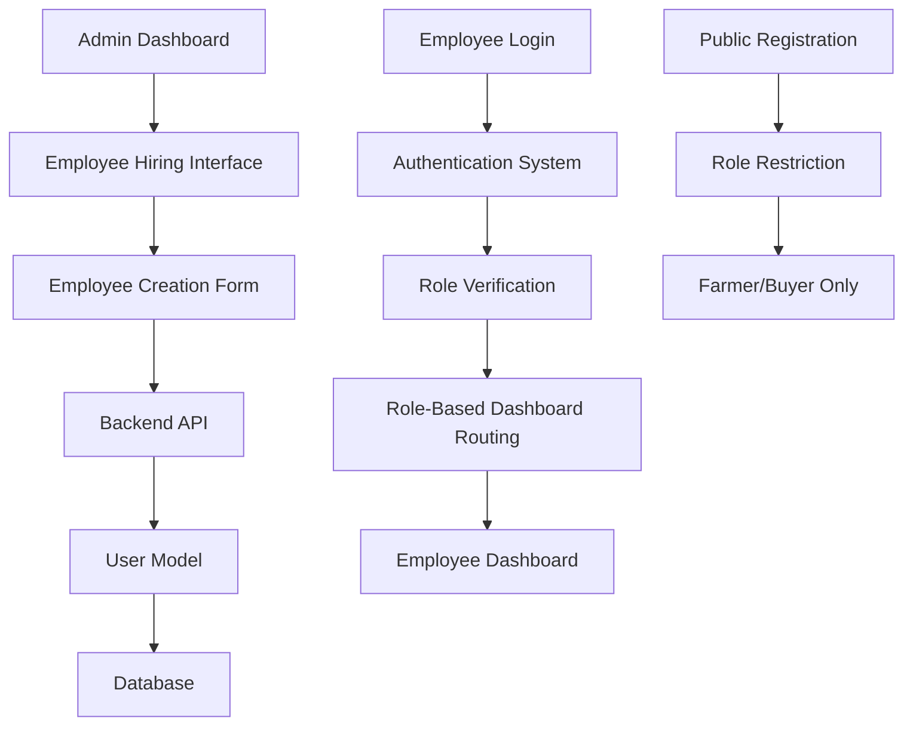

# Design Document: Employee Hiring Management System

## Overview

The Employee Hiring Management system provides administrators with comprehensive tools to hire employees with specific roles, manage their credentials, and ensure proper role-based access control. The system integrates with the existing authentication flow to provide seamless role-based dashboard redirection while removing employee registration from public access.

## Architecture

The system follows a three-tier architecture:

1. **Frontend Layer**: React components for admin employee management interface
2. **Backend Layer**: Node.js/Express API endpoints for employee CRUD operations
3. **Database Layer**: MongoDB with enhanced User model for employee role management

### Component Interaction Flow



## Components and Interfaces

### Frontend Components

#### 1. Employee Hiring Management Page (`HireEmployee.jsx`)
- **Location**: `frontend/src/pages/admin/HireEmployee.jsx`
- **Purpose**: Main interface for creating and managing employees
- **Features**:
  - Employee creation form with role selection
  - Generated credentials display
  - Employee list with search and filtering
  - Employee status management

#### 2. Employee List Component (`EmployeeList.jsx`)
- **Location**: `frontend/src/components/admin/EmployeeList.jsx`
- **Purpose**: Display and manage existing employees
- **Features**:
  - Paginated employee listing
  - Search by name, role, contact information
  - Employee status indicators
  - Quick actions (edit, deactivate, reset password)

#### 3. Employee Creation Modal (`CreateEmployeeModal.jsx`)
- **Location**: `frontend/src/components/admin/CreateEmployeeModal.jsx`
- **Purpose**: Modal form for creating new employees
- **Features**:
  - Form validation
  - Role selection dropdown
  - Credential generation and display
  - Success/error handling

### Backend Components

#### 1. Employee Controller (`employee.admin.controller.js`)
- **Location**: `backend/src/controllers/employee.admin.controller.js`
- **Purpose**: Handle employee management operations
- **Methods**:
  - `createEmployee()`: Create new employee with credentials
  - `getEmployees()`: Retrieve employee list with filtering
  - `updateEmployee()`: Update employee details
  - `resetEmployeePassword()`: Generate new password
  - `toggleEmployeeStatus()`: Activate/deactivate employee

#### 2. Employee Service (`employee.service.js`)
- **Location**: `backend/src/services/employee.service.js`
- **Purpose**: Business logic for employee operations
- **Methods**:
  - `generateEmployeeCredentials()`: Create username/password
  - `validateEmployeeData()`: Validate employee information
  - `assignEmployeeRole()`: Set role-specific permissions

### Database Schema Enhancements

#### Enhanced User Model
```javascript
// Additional fields for employee management
{
  // Existing fields...
  employeeRole: {
    type: String,
    enum: ["milk_collection", "delivery", "loan_and_feed_manager", "general"],
    required: function() { return this.role === "employee"; }
  },
  
  createdBy: {
    type: mongoose.Schema.Types.ObjectId,
    ref: "User",
    required: function() { return this.role === "employee"; }
  },
  
  isActive: {
    type: Boolean,
    default: true
  },
  
  lastLogin: {
    type: Date
  },
  
  passwordResetRequired: {
    type: Boolean,
    default: true // Force password change on first login
  }
}
```

## Data Models

### Employee Creation Request
```typescript
interface EmployeeCreationRequest {
  name: string;
  mobile: string;
  email?: string;
  address?: string;
  employeeRole: "milk_collection" | "delivery" | "loan_and_feed_manager" | "general";
}
```

### Employee Response
```typescript
interface EmployeeResponse {
  id: string;
  uniqueId: string;
  username: string;
  mobile: string;
  email?: string;
  address?: string;
  role: "employee";
  employeeRole: string;
  isActive: boolean;
  createdBy: string;
  createdAt: Date;
  lastLogin?: Date;
  credentials?: {
    username: string;
    password: string;
  };
}
```

### Employee List Filter
```typescript
interface EmployeeFilter {
  employeeRole?: string;
  isActive?: boolean;
  search?: string;
  page?: number;
  limit?: number;
}
```

## Correctness Properties

*A property is a characteristic or behavior that should hold true across all valid executions of a system-essentially, a formal statement about what the system should do. Properties serve as the bridge between human-readable specifications and machine-verifiable correctness guarantees.*

<function_calls>
<invoke name="prework">
<parameter name="featureName">employee-hiring-management

### Property Reflection

After reviewing the prework analysis, I identified several areas where properties can be consolidated:

**Redundancy Analysis:**
- Properties 1.2, 2.1, and 6.2 all relate to role validation - can be combined into comprehensive role validation property
- Properties 1.4, 3.1, and 3.2 all relate to credential generation - can be combined into comprehensive credential generation property
- Properties 4.1, 4.2, and 8.1 all relate to employee data display - can be combined into comprehensive data display property
- Properties 5.1, 5.2, and 7.1 all relate to role-based access control - can be combined into comprehensive access control property

**Consolidated Properties:**
The following properties provide unique validation value after removing redundancy:

### Converting EARS to Properties

Based on the prework analysis, here are the testable correctness properties:

**Property 1: Employee Creation Validation**
*For any* employee creation request, the system should validate that all required fields (name, mobile, role) are present and reject incomplete requests
**Validates: Requirements 1.2**

**Property 2: Unique Credential Generation**
*For any* successful employee creation, the system should generate unique username and secure password credentials that are not duplicated across any existing users
**Validates: Requirements 1.4, 3.1, 3.2**

**Property 3: Password Encryption Storage**
*For any* employee account created, the password should be stored in encrypted form and never stored as plain text
**Validates: Requirements 1.6**

**Property 4: Role-Based Access Control**
*For any* employee login with valid credentials, the system should redirect to the dashboard that matches their assigned employee role
**Validates: Requirements 2.2, 5.1, 5.2**

**Property 5: First Login Password Change**
*For any* newly created employee account, the first login should require a password change before accessing the dashboard
**Validates: Requirements 3.4**

**Property 6: Employee Data Display Completeness**
*For any* employee list request, the response should include all required fields (name, role, contact details, status, activity information)
**Validates: Requirements 4.1, 4.2, 8.1**

**Property 7: Employee Search Functionality**
*For any* search query on the employee list, the results should only include employees whose name, role, or contact information matches the search criteria
**Validates: Requirements 4.3**

**Property 8: Employee Status Management**
*For any* employee status change request, the new status should be immediately applied and persisted in the database
**Validates: Requirements 4.5, 8.4**

**Property 9: Registration Role Restriction**
*For any* public registration attempt, the system should reject any request that includes "employee" as the selected role
**Validates: Requirements 6.2, 6.3, 6.5**

**Property 10: Role-Specific Dashboard Access**
*For any* employee dashboard access, only functionality appropriate to their specific employee role should be available
**Validates: Requirements 7.1, 7.5**

**Property 11: Loan and Feed Manager Role Validation**
*For any* employee creation with loan_and_feed_manager role, the system should validate combined loan and feed management permissions and redirect to appropriate unified dashboard
**Validates: Requirements 9.2, 9.3, 9.8**

## Error Handling

### Validation Errors
- **Invalid Employee Data**: Return structured error messages for missing or invalid fields
- **Duplicate Credentials**: Handle username/mobile conflicts gracefully
- **Role Assignment Errors**: Validate employee role selections against allowed values

### Authentication Errors
- **Invalid Credentials**: Provide secure error messages without revealing system details
- **Role Mismatch**: Handle cases where employee role doesn't match expected dashboard
- **Account Status Issues**: Handle inactive or suspended employee accounts

### System Errors
- **Database Connection**: Graceful degradation when database is unavailable
- **Credential Generation Failures**: Retry mechanisms for unique ID generation
- **Dashboard Routing Errors**: Fallback to default employee dashboard

## Testing Strategy

### Dual Testing Approach

The system will use both unit testing and property-based testing for comprehensive coverage:

**Unit Tests:**
- Specific examples of employee creation with valid/invalid data
- Edge cases for credential generation and validation
- Integration points between admin interface and backend API
- Error conditions and boundary value testing

**Property-Based Tests:**
- Universal properties across all employee management operations
- Comprehensive input coverage through randomized test data
- Each property test will run minimum 100 iterations
- Tests will be tagged with feature and property references

### Property-Based Testing Configuration

Using **Jest** with **fast-check** library for property-based testing:

```javascript
// Example property test structure
describe('Employee Hiring Management Properties', () => {
  test('Property 1: Employee Creation Validation', () => {
    fc.assert(fc.property(
      fc.record({
        name: fc.option(fc.string()),
        mobile: fc.option(fc.string()),
        role: fc.option(fc.constantFrom('milk_collection', 'delivery', 'general'))
      }),
      (employeeData) => {
        // Test that incomplete data is rejected
        // Feature: employee-hiring-management, Property 1: Employee Creation Validation
      }
    ), { numRuns: 100 });
  });
});
```

**Test Tags Format:**
- **Feature: employee-hiring-management, Property 1: Employee Creation Validation**
- **Feature: employee-hiring-management, Property 2: Unique Credential Generation**
- **Feature: employee-hiring-management, Property 3: Password Encryption Storage**

### Integration Testing

- **End-to-End Flows**: Complete employee hiring workflow from creation to first login
- **Role-Based Routing**: Verify correct dashboard redirection for each employee role
- **Admin Interface Integration**: Test admin UI interactions with backend APIs
- **Authentication Flow**: Validate employee login and password change requirements