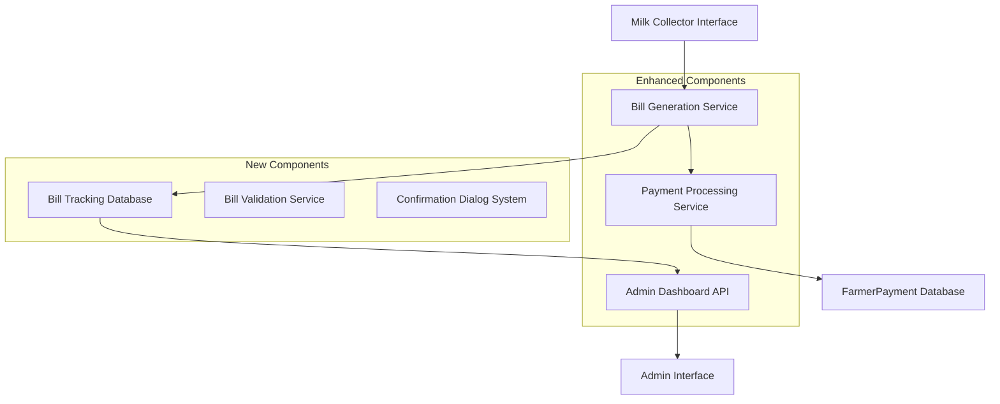

# Enhanced Pending Payment System Design

## Overview

This design document outlines the implementation of an enhanced pending payment system that provides better user experience, prevents duplicate bill generation, and integrates seamlessly with the admin dashboard. The system builds upon the existing milk collection and payment infrastructure while adding intelligent bill tracking and improved user feedback mechanisms.

## Architecture

### System Components



## Components and Interfaces

### 1. Bill Tracking System

**Purpose**: Track generated bills to prevent duplicates and provide history

**Database Schema**: `BillGeneration`
```javascript
{
  _id: ObjectId,
  farmer: ObjectId, // Reference to User
  farmerName: String,
  farmerMobile: String,
  dateFrom: String, // YYYY-MM-DD format
  dateTo: String,   // YYYY-MM-DD format
  generatedBy: ObjectId, // Reference to Employee
  generatedByName: String,
  generatedAt: Date,
  totalAmount: Number,
  totalEntries: Number,
  billData: Object, // Complete bill information
  status: String, // 'active', 'superseded'
  referenceNumber: String // Unique bill reference
}
```

**Key Methods**:
- `checkBillExists(farmerId, dateFrom, dateTo)` - Check if bill exists for date range
- `getBillHistory(farmerId)` - Get all bills for a farmer
- `createBillRecord(billData)` - Create new bill tracking record
- `getOverlappingBills(farmerId, dateFrom, dateTo)` - Find overlapping bill periods

### 2. Enhanced Confirmation Dialog System

**Purpose**: Provide clear user feedback for pending payments

**Component Structure**:
```javascript
// PendingPaymentConfirmation.jsx
{
  isOpen: Boolean,
  farmerName: String,
  amount: Number,
  onConfirm: Function,
  onCancel: Function,
  paymentType: String
}
```

**Features**:
- Clear messaging about pending status
- Visual indicators for payment implications
- Confirmation and cancellation options
- Payment type selection within dialog

### 3. Bill Validation Service

**Purpose**: Validate bill generation requests and prevent duplicates

**Core Logic**:
```javascript
class BillValidationService {
  async validateBillGeneration(farmerId, dateFrom, dateTo) {
    // Check for existing bills
    // Identify new vs existing date ranges
    // Return validation result with recommendations
  }
  
  async getNewDateRanges(farmerId, dateFrom, dateTo) {
    // Calculate date ranges not covered by existing bills
    // Return array of new date ranges
  }
  
  async getBillConflicts(farmerId, dateFrom, dateTo) {
    // Identify conflicting bill periods
    // Return conflict details and resolution options
  }
}
```

## Data Models

### Enhanced FarmerPayment Model

**Existing fields remain unchanged, add tracking fields**:
```javascript
{
  // ... existing fields ...
  billReference: String, // Reference to BillGeneration record
  billPeriod: {
    dateFrom: String,
    dateTo: String,
    billId: ObjectId // Reference to BillGeneration
  }
}
```

### New BillGeneration Model

```javascript
const billGenerationSchema = new mongoose.Schema({
  farmer: { type: ObjectId, ref: 'User', required: true },
  farmerName: { type: String, required: true },
  farmerMobile: { type: String, required: true },
  dateFrom: { type: String, required: true }, // YYYY-MM-DD
  dateTo: { type: String, required: true },   // YYYY-MM-DD
  generatedBy: { type: ObjectId, ref: 'User', required: true },
  generatedByName: { type: String, required: true },
  generatedAt: { type: Date, default: Date.now },
  totalAmount: { type: Number, required: true },
  totalEntries: { type: Number, required: true },
  cowMilk: {
    quantity: Number,
    amount: Number
  },
  buffaloMilk: {
    quantity: Number,
    amount: Number
  },
  billData: { type: Object }, // Complete bill JSON
  status: { 
    type: String, 
    enum: ['active', 'superseded'], 
    default: 'active' 
  },
  referenceNumber: { type: String, unique: true },
  milkEntryIds: [{ type: ObjectId, ref: 'MilkEntry' }] // Track which entries were included
}, {
  timestamps: true,
  indexes: [
    { farmer: 1, dateFrom: 1, dateTo: 1 },
    { farmer: 1, generatedAt: -1 },
    { referenceNumber: 1 }
  ]
});
```

## Correctness Properties

*A property is a characteristic or behavior that should hold true across all valid executions of a system-essentially, a formal statement about what the system should do. Properties serve as the bridge between human-readable specifications and machine-verifiable correctness guarantees.*

### Property 1: Bill Uniqueness
*For any* farmer and date range combination, only one active bill should exist at any time
**Validates: Requirements 2.1, 2.2**

### Property 2: Date Range Integrity
*For any* bill generation request, the system should correctly identify overlapping and new date ranges
**Validates: Requirements 3.1, 3.2, 3.3**

### Property 3: Pending Payment Confirmation
*For any* pending payment action, the system should display confirmation dialog before processing
**Validates: Requirements 1.1, 1.2, 1.3**

### Property 4: Admin Dashboard Consistency
*For any* new bill generation, the admin dashboard should reflect the updated last bill generation date
**Validates: Requirements 4.1, 4.2, 4.3**

### Property 5: Payment Status Visibility
*For any* farmer payment row, the system should display the correct payment status based on current data
**Validates: Requirements 5.1, 5.2, 5.3, 5.4**

### Property 6: Bill History Completeness
*For any* farmer with generated bills, the bill history should include all generated bills in chronological order
**Validates: Requirements 6.1, 6.2, 6.3, 6.4**

### Property 7: Error Prevention
*For any* invalid bill generation request, the system should prevent processing and provide clear error messages
**Validates: Requirements 7.1, 7.2, 7.3, 7.4**

## Error Handling

### Bill Generation Errors
- **Duplicate Bill Error**: Clear message indicating existing bill with option to view
- **Date Range Error**: Validation messages for invalid date selections
- **No Data Error**: Informative message when no milk entries exist for selected dates
- **Overlap Conflict**: Detailed explanation of date range conflicts with resolution options

### Payment Processing Errors
- **Network Errors**: Retry mechanisms with user feedback
- **Validation Errors**: Clear field-specific error messages
- **Confirmation Errors**: Fallback to previous state with error notification

### Data Consistency Errors
- **Missing References**: Automatic cleanup and user notification
- **Orphaned Records**: Background cleanup with audit logging
- **Concurrent Modifications**: Optimistic locking with conflict resolution

## Testing Strategy

### Unit Tests
- Bill validation logic with various date range scenarios
- Payment confirmation dialog behavior
- Admin dashboard data aggregation
- Error handling for edge cases

### Property-Based Tests
- **Property 1 Test**: Generate random farmer/date combinations and verify bill uniqueness
- **Property 2 Test**: Test date range overlap detection with random date ranges
- **Property 3 Test**: Verify confirmation dialog appears for all pending payment actions
- **Property 4 Test**: Validate admin dashboard updates after bill generation
- **Property 5 Test**: Check payment status display accuracy across different states
- **Property 6 Test**: Verify bill history completeness and ordering
- **Property 7 Test**: Test error prevention with invalid inputs

### Integration Tests
- End-to-end bill generation workflow
- Payment processing with bill tracking
- Admin dashboard integration
- Cross-module data consistency

### User Experience Tests
- Confirmation dialog usability
- Error message clarity
- Visual indicator effectiveness
- Workflow completion rates

## Implementation Phases

### Phase 1: Database and Core Services
1. Create BillGeneration model and database schema
2. Implement BillValidationService
3. Add bill tracking to existing bill generation API
4. Create bill history retrieval endpoints

### Phase 2: Enhanced User Interface
1. Implement enhanced confirmation dialogs
2. Add bill history viewing capabilities
3. Improve payment status indicators
4. Add error handling and user feedback

### Phase 3: Admin Dashboard Integration
1. Update admin APIs to include bill generation data
2. Enhance admin farmer payments page
3. Add last bill generation tracking
4. Implement bill history viewing in admin

### Phase 4: Testing and Optimization
1. Comprehensive testing of all components
2. Performance optimization for date range queries
3. User acceptance testing
4. Documentation and training materials

## Security Considerations

### Data Protection
- Encrypt sensitive bill data in database
- Implement proper access controls for bill history
- Audit logging for all bill generation activities
- Secure API endpoints with proper authentication

### Input Validation
- Sanitize all date inputs to prevent injection attacks
- Validate farmer IDs and permissions
- Rate limiting for bill generation requests
- CSRF protection for all form submissions

### Audit Trail
- Log all bill generation activities
- Track payment status changes
- Monitor admin dashboard access
- Alert on suspicious billing patterns