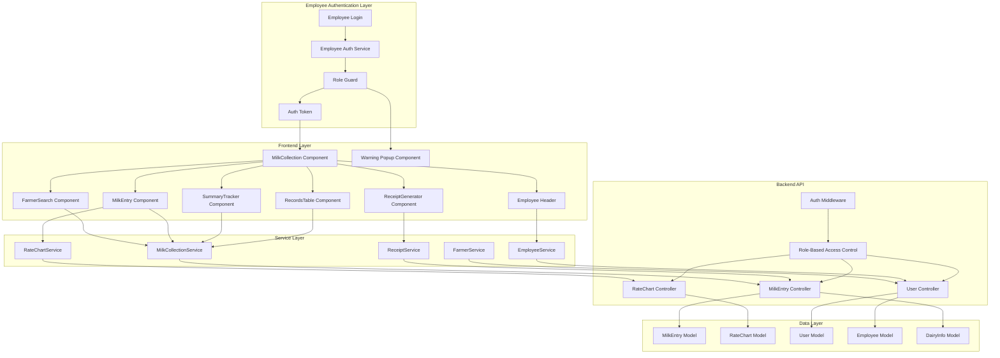
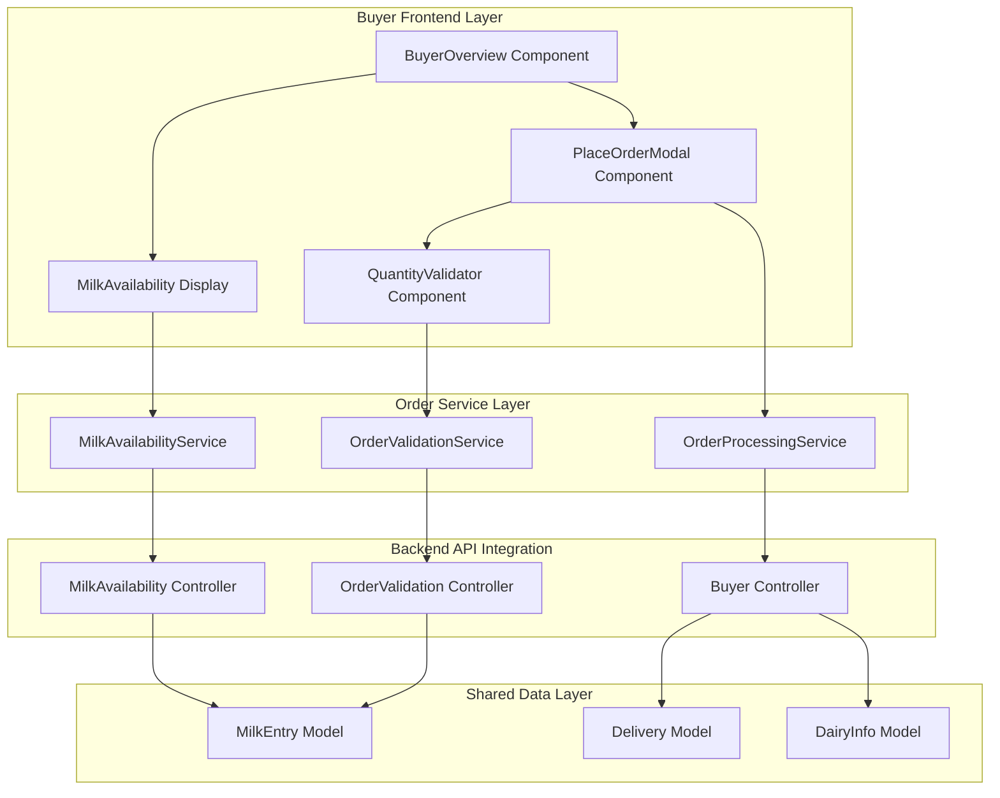
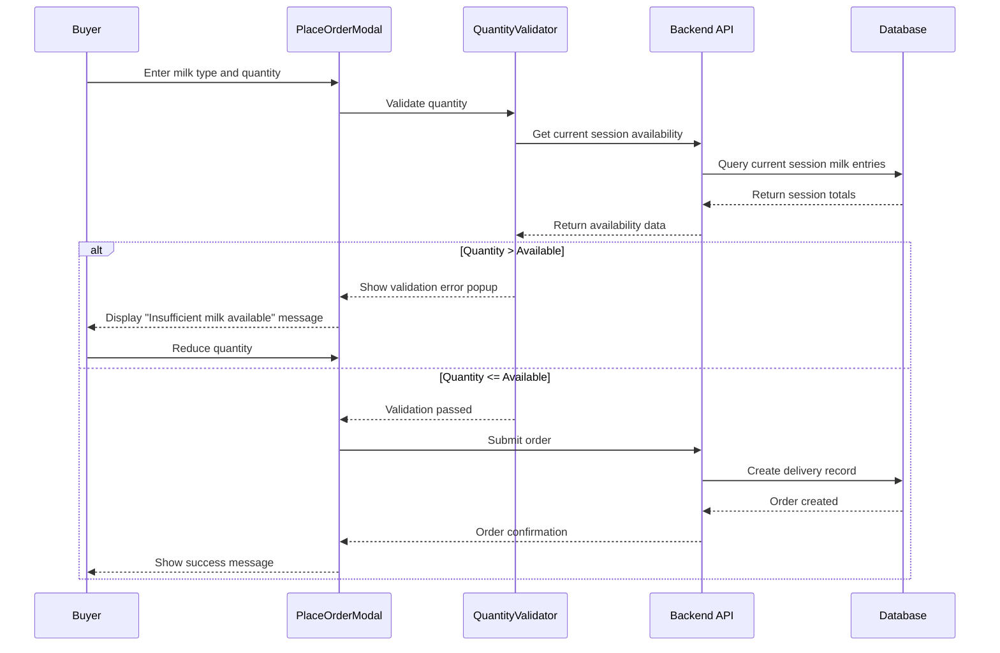

# Design Document: Milk Collection System

## Overview

The Milk Collection System is a comprehensive replacement for the existing milk collection functionality, designed to provide a streamlined, role-ready workflow that matches real dairy operations. The system features automatic session management, farmer identification, rate chart integration, receipt generation, and real-time analytics.

The design emphasizes user experience optimization for milk collector employees while maintaining data integrity and providing comprehensive audit trails. The system integrates with the employee dashboard and role-based authentication system, ensuring that only authorized milk collector employees can access the functionality. The system serves as the primary landing page for milk collector employees after login.

The design integrates with existing backend models while introducing enhanced frontend components for improved workflow efficiency and employee session management.

## Architecture

### System Architecture



### Component Hierarchy

```mermaid
graph TD
    MilkCollection[MilkCollection Page]
    
    MilkCollection --> Header[Page Header]
    MilkCollection --> SessionSelector[Session Selector]
    MilkCollection --> FarmerSearch[Farmer Search]
    MilkCollection --> MilkEntryForm[Milk Entry Form]
    MilkCollection --> SummaryBox[Live Summary Box]
    MilkCollection --> RecordsTable[Records Table]
    MilkCollection --> ReceiptModal[Receipt Modal]
    
    Header --> DateDisplay[Auto Date Display]
    Header --> TimeDisplay[Auto Time Display]
    Header --> DairyName[Dairy Name Display]
    
    SessionSelector --> MorningOption[Morning Session]
    SessionSelector --> EveningOption[Evening Session]
    
    FarmerSearch --> FarmerIdInput[Farmer ID Input]
    FarmerSearch --> FetchButton[Fetch Button]
    FarmerSearch --> FarmerNameDisplay[Farmer Name Display]
    
    MilkEntryForm --> CowMilkSection[Cow Milk Section]
    MilkEntryForm --> BuffaloMilkSection[Buffalo Milk Section]
    MilkEntryForm --> TotalCalculation[Total Calculation]
    MilkEntryForm --> SaveButton[Save Button]
    
    CowMilkSection --> CowQuantity[Quantity Input]
    CowMilkSection --> CowFat[Fat % Input]
    CowMilkSection --> CowRate[Rate Display]
    CowMilkSection --> CowAmount[Amount Display]
    
    BuffaloMilkSection --> BuffaloQuantity[Quantity Input]
    BuffaloMilkSection --> BuffaloFat[Fat % Input]
    BuffaloMilkSection --> BuffaloRate[Rate Display]
    BuffaloMilkSection --> BuffaloAmount[Amount Display]
    
    SummaryBox --> CowTotal[Cow Milk Total]
    SummaryBox --> BuffaloTotal[Buffalo Milk Total]
    SummaryBox --> AvgFat[Average Fat %]
    SummaryBox --> SessionTotal[Session Total Amount]
    
    RecordsTable --> TableHeader[Table Headers]
    RecordsTable --> TableRows[Data Rows]
    RecordsTable --> SerialNumbers[Auto Serial Numbers]
    
    ReceiptModal --> ReceiptContent[Receipt Content]
    ReceiptModal --> PrintButton[Print Option]
    ReceiptModal --> DownloadButton[PDF Download]
```



## Components and Interfaces

### Core Components

#### 1. MilkCollection (Main Page Component)
```typescript
interface MilkCollectionProps {
  employee: EmployeeProfile;
  dairyInfo: DairyInfo;
  authToken: string;
}

interface MilkCollectionState {
  currentSession: 'Morning' | 'Evening';
  selectedDate: string;
  currentTime: string;
  farmerData: FarmerData | null;
  milkEntries: MilkEntryRecord[];
  sessionSummary: SessionSummary;
  showReceipt: boolean;
  lastSavedEntry: MilkEntryRecord | null;
  isLoading: boolean;
  error: string | null;
}

interface EmployeeProfile {
  id: string;
  uniqueId: string;
  name: string;
  mobile: string;
  role: 'milk_collector' | 'admin';
  isActive: boolean;
}
```

#### 2. FarmerSearch Component
```typescript
interface FarmerSearchProps {
  onFarmerFetched: (farmer: FarmerData) => void;
  onError: (error: string) => void;
}

interface FarmerData {
  id: string;
  uniqueId: string;
  name: string;
  mobile: string;
  isActive: boolean;
}
```

#### 3. MilkEntryForm Component
```typescript
interface MilkEntryFormProps {
  farmer: FarmerData;
  session: 'Morning' | 'Evening';
  onSave: (entry: MilkEntryData) => void;
  onRateCalculated: (milkType: 'cow' | 'buffalo', rate: number) => void;
}

interface MilkEntryData {
  farmerId: string;
  farmerName: string;
  session: 'Morning' | 'Evening';
  date: string;
  cow: {
    quantity: number;
    fat: number;
    rate: number;
    amount: number;
  };
  buffalo: {
    quantity: number;
    fat: number;
    rate: number;
    amount: number;
  };
  totalAmount: number;
}
```

#### 4. ReceiptGenerator Component
```typescript
interface ReceiptGeneratorProps {
  entry: MilkEntryRecord;
  dairyInfo: DairyInfo;
  onClose: () => void;
  onPrint: () => void;
  onDownload: () => void;
}

interface ReceiptData {
  dairyName: string;
  date: string;
  session: string;
  time: string;
  farmerId: string;
  farmerName: string;
  cowMilk: MilkDetails;
  buffaloMilk: MilkDetails;
  totalAmount: number;
}
```

#### 5. LiveSummary Component
```typescript
interface LiveSummaryProps {
  entries: MilkEntryRecord[];
  session: 'Morning' | 'Evening';
  date: string;
}

interface SessionSummary {
  cowMilkTotal: number;
  buffaloMilkTotal: number;
  averageFat: number;
  totalAmount: number;
  entryCount: number;
  session: string;
}
```

#### 6. EmployeeHeader Component
```typescript
interface EmployeeHeaderProps {
  employee: EmployeeProfile;
  currentSession: 'Morning' | 'Evening';
  onSessionChange: (session: 'Morning' | 'Evening') => void;
  onLogout: () => void;
}
```

#### 7. RoleGuard Component
```typescript
interface RoleGuardProps {
  requiredRole: 'milk_collector' | 'admin';
  userRole: string;
  children: React.ReactNode;
  fallbackComponent?: React.ComponentType;
}

interface AccessDeniedProps {
  userRole: string;
  message: string;
  redirectPath: string;
}
```

#### 8. WarningPopup Component
```typescript
interface WarningPopupProps {
  isOpen: boolean;
  message: string;
  onClose: () => void;
  onRedirect: () => void;
  redirectPath: string;
}
```

### Service Interfaces

#### 5. EmployeeService
```typescript
interface EmployeeService {
  getCurrentEmployee(): Promise<EmployeeProfile>;
  validateEmployeeAccess(page: string): Promise<AccessResult>;
  getEmployeeToken(): string | null;
  refreshEmployeeToken(): Promise<string>;
  logout(): void;
}

interface AccessResult {
  allowed: boolean;
  message?: string;
  redirectPath?: string;
}
```

#### 1. MilkCollectionService
```typescript
interface MilkCollectionService {
  saveMilkEntry(entry: MilkEntryData): Promise<MilkEntryRecord>;
  getMilkEntries(date: string, session?: string): Promise<MilkEntryRecord[]>;
  getSessionSummary(date: string, session: string): Promise<SessionSummary>;
  validateMilkEntry(entry: MilkEntryData): ValidationResult;
}
```

#### 2. RateChartService
```typescript
interface RateChartService {
  getRate(milkType: 'cow' | 'buffalo', fatPercentage: number): Promise<number>;
  getCurrentRateChart(): Promise<RateChart>;
  calculateAmount(quantity: number, rate: number): number;
}
```

#### 3. FarmerService
```typescript
interface FarmerService {
  getFarmerById(farmerId: string): Promise<FarmerData>;
  getFarmerByMobile(mobile: string): Promise<FarmerData>;
  validateFarmerId(farmerId: string): boolean;
}
```

#### 4. ReceiptService
```typescript
interface ReceiptService {
  generateReceipt(entry: MilkEntryRecord, dairyInfo: DairyInfo): ReceiptData;
  printReceipt(receiptData: ReceiptData): void;
  downloadReceiptPDF(receiptData: ReceiptData): void;
}
```

## Data Models

### Enhanced MilkEntry Model
```typescript
interface MilkEntryRecord {
  id: string;
  date: string;
  session: 'Morning' | 'Evening';
  time: string;
  farmerId: string;
  farmerUniqueId: string;
  farmerName: string;
  collectedBy: string;
  collectedByUniqueId: string;
  collectedByName: string;
  collectedByRole: 'milk_collector' | 'admin';
  cow: {
    quantity: number;
    fat: number;
    rate: number;
    amount: number;
  };
  buffalo: {
    quantity: number;
    fat: number;
    rate: number;
    amount: number;
  };
  totalAmount: number;
  receiptGenerated: boolean;
  createdAt: Date;
  updatedAt: Date;
}
```

### Employee Model Integration
```typescript
interface Employee {
  id: string;
  uniqueId: string;
  name: string;
  mobile: string;
  role: 'milk_collector' | 'delivery_boy' | 'loan_feed_manager';
  isActive: boolean;
  isApproved: boolean;
  createdBy: string;
  createdAt: Date;
  updatedAt: Date;
}

interface EmployeeAuthToken {
  employeeId: string;
  role: string;
  mobile: string;
  issuedAt: number;
  expiresAt: number;
}
```

### Session Summary Model
```typescript
interface SessionSummary {
  date: string;
  session: 'Morning' | 'Evening';
  cowMilkTotal: number;
  buffaloMilkTotal: number;
  totalMilk: number;
  averageFat: number;
  totalAmount: number;
  entryCount: number;
  farmerCount: number;
  lastUpdated: Date;
}
```

### Rate Chart Integration Model
```typescript
interface RateChartEntry {
  milkType: 'cow' | 'buffalo';
  fatPercentage: number;
  rate: number;
  effectiveDate: string;
  isActive: boolean;
}
```

Now I'll use the prework tool to analyze the acceptance criteria before writing correctness properties.

## Buyer Order System Integration

### Buyer Order Architecture



### Order Validation Flow



### Mixed Milk Removal Design

The system will be updated to remove all mixed milk functionality:

1. **Frontend Changes:**
   - Remove "Mixed" or "Both" option from milk type selectors
   - Remove mixed milk rate displays
   - Update validation to only accept "cow" or "buffalo"

2. **Backend Changes:**
   - Update API validation to reject mixed milk types
   - Remove mixed milk rate calculations
   - Update order processing to handle only cow/buffalo types

3. **Data Model Updates:**
   - Ensure milk type enum only includes "cow" and "buffalo"
   - Remove any mixed milk references from existing data

<function_calls>
<invoke name="prework">
<parameter name="featureName">milk-collection-system

## Correctness Properties

*A property is a characteristic or behavior that should hold true across all valid executions of a system-essentially, a formal statement about what the system should do. Properties serve as the bridge between human-readable specifications and machine-verifiable correctness guarantees.*

### Session-Based Availability Properties

**Property 1: Session Isolation**
*For any* session transition from Morning to Evening or Evening to Morning, the new session availability should start at 0L for all milk types regardless of previous session totals
**Validates: Requirements 12.4, 12.8**

**Property 2: Current Session Display**
*For any* active dairy session, the displayed availability should only include milk collected in the current session (Morning OR Evening), not combined totals
**Validates: Requirements 12.1, 12.7**

**Property 3: Real-time Session Updates**
*For any* milk collection entry added during an active session, the session availability should update to reflect the new totals immediately
**Validates: Requirements 12.2**

**Property 4: Session Data Structure**
*For any* session availability display, it should contain separate totals for cow milk, buffalo milk, and session grand total
**Validates: Requirements 12.5**

**Property 5: Session Name Display**
*For any* availability display, it should include the current session name (Morning or Evening)
**Validates: Requirements 12.6**

### Order Validation Properties

**Property 6: Cow Milk Quantity Validation**
*For any* cow milk order quantity, if it exceeds the current session cow milk availability, the validation should fail and prevent order submission
**Validates: Requirements 13.1, 13.4**

**Property 7: Buffalo Milk Quantity Validation**
*For any* buffalo milk order quantity, if it exceeds the current session buffalo milk availability, the validation should fail and prevent order submission
**Validates: Requirements 13.2, 13.4**

**Property 8: Valid Order Processing**
*For any* order quantity that is within available limits for the specified milk type, the order should be allowed to proceed
**Validates: Requirements 13.5**

**Property 9: Dynamic Validation Updates**
*For any* change in session milk availability, existing order validations should update to reflect the new availability limits
**Validates: Requirements 13.7**

### Mixed Milk Removal Properties

**Property 10: Milk Type Restriction**
*For any* order placement attempt, only "cow" or "buffalo" should be accepted as valid milk types, and any other type should be rejected
**Validates: Requirements 14.5, 14.7**

**Property 11: Rate Display Limitation**
*For any* milk rate display, only cow milk rate and buffalo milk rate should be shown, with no mixed milk rates present
**Validates: Requirements 14.4**

**Property 12: Mixed Milk Calculation Removal**
*For any* order processing operation, no mixed milk rate calculations should be performed
**Validates: Requirements 14.2**

**Property 13: Historical Data Cleanup**
*For any* order history or receipt display, no mixed milk references should appear
**Validates: Requirements 14.6**

## Error Handling

### Order Validation Errors

1. **Insufficient Milk Availability**
   - **Trigger**: When order quantity exceeds current session availability
   - **Response**: Display popup with message "Insufficient milk available. Available: [X]L, Requested: [Y]L"
   - **Recovery**: Allow user to reduce quantity and retry

2. **Invalid Milk Type**
   - **Trigger**: When mixed milk or invalid milk type is submitted
   - **Response**: Reject order with error message "Invalid milk type. Only cow or buffalo milk orders are accepted"
   - **Recovery**: Force user to select valid milk type

3. **Session Availability Fetch Failure**
   - **Trigger**: When API fails to retrieve current session data
   - **Response**: Display "Unable to load milk availability. Please try again."
   - **Recovery**: Provide retry mechanism and fallback to cached data if available

4. **Real-time Update Failure**
   - **Trigger**: When session availability updates fail to sync
   - **Response**: Show warning "Availability data may not be current. Please refresh."
   - **Recovery**: Provide manual refresh option

### System State Errors

1. **Dairy Closed During Order**
   - **Trigger**: When dairy closes while user is placing order
   - **Response**: Close order modal with message "Dairy has closed. Orders cannot be processed."
   - **Recovery**: Redirect to dairy status information

2. **Session Transition During Order**
   - **Trigger**: When session changes while order is in progress
   - **Response**: Update availability and re-validate order quantities
   - **Recovery**: Allow user to adjust order for new session availability

## Testing Strategy

### Unit Testing Approach

**Core Logic Tests:**
- Session availability calculation functions
- Order quantity validation logic
- Milk type validation functions
- Error message formatting
- API response parsing

**Component Tests:**
- PlaceOrderModal component behavior
- QuantityValidator component logic
- MilkAvailability display component
- Error popup components

**Integration Tests:**
- Order placement flow end-to-end
- Session availability updates
- Real-time validation updates
- Error handling workflows

### Property-Based Testing Configuration

**Framework**: Use Jest with fast-check for JavaScript property-based testing
**Minimum Iterations**: 100 per property test
**Test Environment**: Node.js with MongoDB test database

**Property Test Implementation:**
- Each correctness property will be implemented as a separate property-based test
- Tests will generate random session data, availability values, and order quantities
- All tests will be tagged with format: **Feature: milk-collection-system, Property {number}: {property_text}**

**Test Data Generation:**
- Session data: Random dates, session types (Morning/Evening), milk quantities
- Order data: Random quantities, milk types, user inputs
- Availability data: Random current session totals for cow and buffalo milk
- Error scenarios: Invalid inputs, edge cases, boundary conditions

**Coverage Requirements:**
- All acceptance criteria must be covered by either unit tests or property tests
- Property tests handle universal behaviors across all inputs
- Unit tests handle specific examples, edge cases, and error conditions
- Integration tests verify component interactions and API integrations