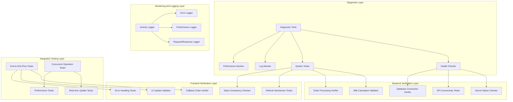
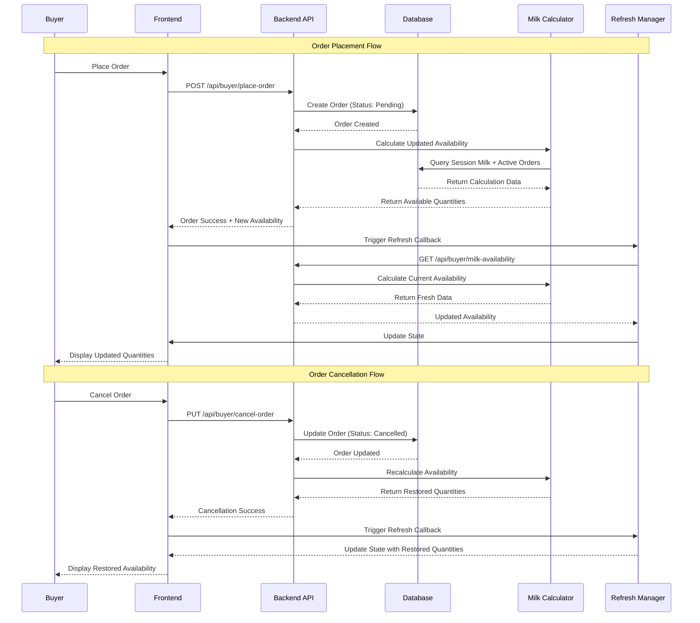
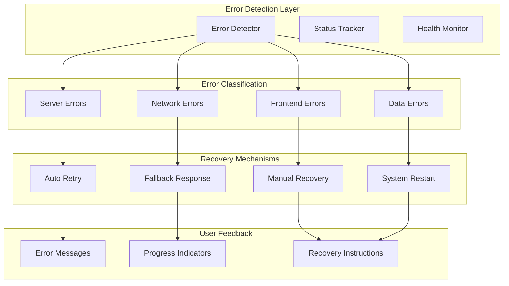

# Design Document: Milk Deduction System Debug

## Overview

The Milk Deduction System Debug is a comprehensive diagnostic and fixing system designed to identify and resolve issues in the dairy management system where milk quantities are not properly deducting when orders are placed. The system provides systematic debugging tools, automated health checks, enhanced error handling, and robust real-time synchronization between backend calculations and frontend display.

The design focuses on creating a reliable, self-diagnosing system that can identify root causes of milk deduction failures, provide automated fixes where possible, and ensure long-term system reliability. The solution addresses both immediate debugging needs and implements preventive measures to avoid future issues.

## Architecture

### System Diagnostic Architecture



### Milk Deduction Flow Architecture



### Error Detection and Recovery Architecture



## Components and Interfaces

### Core Diagnostic Components

#### 1. SystemDiagnostic (Main Diagnostic Controller)
```typescript
interface SystemDiagnosticProps {
  autoRun?: boolean;
  verbose?: boolean;
  onComplete?: (results: DiagnosticResults) => void;
}

interface DiagnosticResults {
  overall: 'healthy' | 'warning' | 'critical';
  backend: BackendHealthStatus;
  frontend: FrontendHealthStatus;
  integration: IntegrationHealthStatus;
  recommendations: string[];
  fixes: AutoFixResult[];
}

interface BackendHealthStatus {
  serverRunning: boolean;
  apiConnectivity: boolean;
  databaseConnection: boolean;
  milkCalculationAccuracy: boolean;
  orderProcessing: boolean;
  responseTime: number;
  errors: string[];
}

interface FrontendHealthStatus {
  refreshMechanismWorking: boolean;
  stateUpdateFunctioning: boolean;
  callbackChainIntact: boolean;
  uiRenderingCorrectly: boolean;
  errorHandlingActive: boolean;
  performanceAcceptable: boolean;
  errors: string[];
}
```

#### 2. BackendHealthChecker
```typescript
interface BackendHealthCheckerProps {
  serverUrl: string;
  timeout: number;
  retryAttempts: number;
}

interface BackendHealthChecker {
  checkServerStatus(): Promise<ServerStatusResult>;
  validateApiEndpoints(): Promise<ApiValidationResult>;
  testDatabaseConnection(): Promise<DatabaseConnectionResult>;
  verifyMilkCalculations(): Promise<CalculationValidationResult>;
  testOrderProcessing(): Promise<OrderProcessingResult>;
}

interface ServerStatusResult {
  isRunning: boolean;
  port: number;
  responseTime: number;
  version: string;
  uptime: number;
  error?: string;
}

interface ApiValidationResult {
  endpoints: EndpointTestResult[];
  overallHealth: boolean;
  averageResponseTime: number;
}

interface EndpointTestResult {
  path: string;
  method: string;
  status: number;
  responseTime: number;
  success: boolean;
  error?: string;
}
```

#### 3. FrontendHealthChecker
```typescript
interface FrontendHealthChecker {
  checkRefreshMechanism(): RefreshMechanismResult;
  validateStateUpdates(): StateUpdateResult;
  testCallbackChain(): CallbackChainResult;
  verifyUiUpdates(): UiUpdateResult;
  testErrorHandling(): ErrorHandlingResult;
}

interface RefreshMechanismResult {
  functionExists: boolean;
  functionExecutes: boolean;
  triggersApiCall: boolean;
  updatesState: boolean;
  error?: string;
}

interface StateUpdateResult {
  reactStateUpdates: boolean;
  forceReRender: boolean;
  dataConsistency: boolean;
  updateTiming: number;
  error?: string;
}
```

#### 4. MilkCalculationValidator
```typescript
interface MilkCalculationValidator {
  validateSessionCalculation(date: string, session: string): Promise<CalculationValidationResult>;
  testOrderReservation(orders: TestOrder[]): Promise<ReservationTestResult>;
  verifyAvailabilityAccuracy(): Promise<AccuracyTestResult>;
  testConcurrentUpdates(): Promise<ConcurrencyTestResult>;
}

interface CalculationValidationResult {
  sessionTotal: number;
  reservedQuantity: number;
  availableQuantity: number;
  calculationAccurate: boolean;
  expectedVsActual: {
    expected: MilkAvailability;
    actual: MilkAvailability;
    match: boolean;
  };
  error?: string;
}

interface TestOrder {
  milkType: 'cow' | 'buffalo';
  quantity: number;
  status: 'Pending' | 'Approved' | 'Out for Delivery' | 'Cancelled';
}
```

#### 5. RealTimeUpdateTester
```typescript
interface RealTimeUpdateTester {
  testOrderPlacementFlow(): Promise<OrderFlowTestResult>;
  testOrderCancellationFlow(): Promise<CancellationFlowTestResult>;
  testConcurrentOperations(): Promise<ConcurrencyTestResult>;
  measureUpdateLatency(): Promise<LatencyTestResult>;
}

interface OrderFlowTestResult {
  orderCreated: boolean;
  quantityDeducted: boolean;
  frontendUpdated: boolean;
  updateLatency: number;
  stepsCompleted: string[];
  errors: string[];
}

interface CancellationFlowTestResult {
  orderCancelled: boolean;
  quantityRestored: boolean;
  frontendUpdated: boolean;
  updateLatency: number;
  stepsCompleted: string[];
  errors: string[];
}
```

### Enhanced Error Handling Components

#### 6. ErrorRecoveryManager
```typescript
interface ErrorRecoveryManager {
  handleServerError(error: ServerError): Promise<RecoveryResult>;
  handleNetworkError(error: NetworkError): Promise<RecoveryResult>;
  handleFrontendError(error: FrontendError): Promise<RecoveryResult>;
  handleDataError(error: DataError): Promise<RecoveryResult>;
}

interface RecoveryResult {
  success: boolean;
  action: 'retry' | 'fallback' | 'manual' | 'restart';
  message: string;
  nextSteps: string[];
  autoRetryIn?: number;
}

interface ServerError {
  type: 'connection' | 'timeout' | 'internal' | 'unavailable';
  message: string;
  statusCode?: number;
  endpoint?: string;
}
```

#### 7. AutoFixEngine
```typescript
interface AutoFixEngine {
  detectIssues(): Promise<DetectedIssue[]>;
  applyFixes(issues: DetectedIssue[]): Promise<FixResult[]>;
  validateFixes(): Promise<ValidationResult>;
}

interface DetectedIssue {
  type: 'server_down' | 'callback_missing' | 'state_stale' | 'calculation_error';
  severity: 'low' | 'medium' | 'high' | 'critical';
  description: string;
  autoFixable: boolean;
  fixAction?: string;
}

interface FixResult {
  issue: DetectedIssue;
  applied: boolean;
  success: boolean;
  message: string;
  requiresManualAction: boolean;
  manualSteps?: string[];
}
```

### Monitoring and Logging Components

#### 8. ComprehensiveLogger
```typescript
interface ComprehensiveLogger {
  logOrderOperation(operation: OrderOperation): void;
  logMilkCalculation(calculation: MilkCalculationLog): void;
  logRefreshOperation(refresh: RefreshOperationLog): void;
  logError(error: ErrorLog): void;
  logPerformance(performance: PerformanceLog): void;
  generateHealthReport(): HealthReport;
}

interface OrderOperation {
  type: 'place' | 'cancel' | 'update';
  orderId: string;
  milkType: 'cow' | 'buffalo';
  quantity: number;
  timestamp: Date;
  userId: string;
  success: boolean;
  error?: string;
}

interface MilkCalculationLog {
  sessionDate: string;
  sessionType: 'Morning' | 'Evening';
  totalCollected: MilkQuantities;
  totalReserved: MilkQuantities;
  totalAvailable: MilkQuantities;
  calculationTime: number;
  timestamp: Date;
}

interface RefreshOperationLog {
  trigger: 'manual' | 'callback' | 'polling' | 'auto';
  success: boolean;
  responseTime: number;
  dataChanged: boolean;
  previousState: MilkAvailability;
  newState: MilkAvailability;
  timestamp: Date;
}
```

## Data Models

### Enhanced Diagnostic Data Models

#### Diagnostic Session Model
```typescript
interface DiagnosticSession {
  id: string;
  startTime: Date;
  endTime?: Date;
  status: 'running' | 'completed' | 'failed';
  results: DiagnosticResults;
  fixes: AutoFixResult[];
  userActions: UserAction[];
  systemState: SystemStateSnapshot;
}

interface SystemStateSnapshot {
  backendStatus: BackendHealthStatus;
  frontendStatus: FrontendHealthStatus;
  activeOrders: number;
  milkAvailability: MilkAvailability;
  lastSuccessfulOperation?: Date;
  errorCount: number;
  performanceMetrics: PerformanceMetrics;
}
```

#### Enhanced Error Tracking Model
```typescript
interface ErrorTrackingRecord {
  id: string;
  timestamp: Date;
  errorType: 'server' | 'network' | 'frontend' | 'data' | 'calculation';
  severity: 'low' | 'medium' | 'high' | 'critical';
  message: string;
  stackTrace?: string;
  userAgent?: string;
  userId?: string;
  systemState: SystemStateSnapshot;
  recoveryAttempts: RecoveryAttempt[];
  resolved: boolean;
  resolutionTime?: Date;
}

interface RecoveryAttempt {
  timestamp: Date;
  action: string;
  success: boolean;
  message: string;
  autoRetry: boolean;
}
```

#### Performance Monitoring Model
```typescript
interface PerformanceMetrics {
  apiResponseTimes: {
    milkAvailability: number[];
    orderPlacement: number[];
    orderCancellation: number[];
  };
  frontendUpdateTimes: number[];
  refreshOperationTimes: number[];
  errorRates: {
    server: number;
    network: number;
    frontend: number;
  };
  successRates: {
    orderPlacement: number;
    orderCancellation: number;
    refreshOperations: number;
  };
  concurrentUserCount: number;
  systemLoad: number;
}
```

Now I'll use the prework tool to analyze the acceptance criteria before writing correctness properties:

## Correctness Properties

*A property is a characteristic or behavior that should hold true across all valid executions of a system-essentially, a formal statement about what the system should do. Properties serve as the bridge between human-readable specifications and machine-verifiable correctness guarantees.*

### Diagnostic System Properties

**Property 1: Comprehensive System Health Detection**
*For any* system state, the diagnostic system should correctly identify backend server status, API connectivity, database connection, and frontend refresh mechanisms
**Validates: Requirements 1.1, 1.2, 1.3, 1.4, 1.7**

**Property 2: Backend Health Validation**
*For any* backend server configuration, the health checker should correctly identify server status, API endpoint functionality, database connectivity, and response times within specified limits
**Validates: Requirements 2.1, 2.5, 2.6, 2.7**

**Property 3: Milk Calculation Accuracy Validation**
*For any* set of milk entries and orders, the calculation validator should verify that availability calculations include correct session data and proper order status filtering
**Validates: Requirements 1.6, 2.2, 2.3, 6.1, 6.2, 6.3, 6.4**

### Order Flow Properties

**Property 4: Order Placement Flow Integrity**
*For any* valid order placement, the system should create the order with "Pending" status, deduct milk quantities correctly, and trigger frontend refresh callbacks within 3 seconds
**Validates: Requirements 3.1, 3.2, 3.3, 3.4**

**Property 5: Order Cancellation Flow Integrity**
*For any* order cancellation, the system should update order status to "Cancelled", restore milk quantities correctly, and trigger frontend refresh callbacks within 3 seconds
**Validates: Requirements 4.1, 4.2, 4.3, 4.4**

**Property 6: Order Status Inclusion Logic**
*For any* milk availability calculation, orders with "Pending", "Approved", and "Out for Delivery" statuses should be included in reservations, while "Cancelled" orders should be excluded
**Validates: Requirements 3.5, 4.5, 6.2, 6.3**

**Property 7: Concurrent Operation Safety**
*For any* set of concurrent order operations (placement or cancellation), the system should maintain data consistency and handle all operations without corruption
**Validates: Requirements 3.6, 4.7, 12.2**

### Frontend Update Properties

**Property 8: Real-Time Frontend Updates**
*For any* milk availability change, the frontend should fetch latest data, update React state, force re-renders, and display new quantities within 3 seconds without page reload
**Validates: Requirements 5.1, 5.2, 5.3, 5.4**

**Property 9: Polling and Manual Refresh Behavior**
*For any* active system, automatic polling should check for updates every 5 seconds, and manual refresh should provide immediate feedback and updates
**Validates: Requirements 5.5, 5.6**

**Property 10: Network Error Recovery**
*For any* network error during refresh operations, the system should retry with exponential backoff and queue requests when connectivity is lost
**Validates: Requirements 5.7, 7.2, 7.5**

### Error Handling Properties

**Property 11: Error Message and Recovery Provision**
*For any* system error (server unavailable, order failure, refresh failure), the system should display appropriate error messages and provide clear recovery instructions
**Validates: Requirements 7.1, 7.3, 7.4, 7.7**

**Property 12: Error Logging Completeness**
*For any* system operation (orders, calculations, refreshes, errors, API requests, state updates), the system should log all relevant details including timestamps, data values, and system state
**Validates: Requirements 8.1, 8.2, 8.3, 8.4, 8.5, 8.6**

### System Reliability Properties

**Property 13: Automated Test Suite Validation**
*For any* system state, the automated test suite should correctly verify backend connectivity, order placement accuracy, cancellation accuracy, and end-to-end workflow functionality
**Validates: Requirements 9.1, 9.2, 9.3, 9.7**

**Property 14: Performance and Timing Requirements**
*For any* system operation, milk availability requests should complete within 500ms, order processing within 1 second, and concurrent user operations within 2 seconds
**Validates: Requirements 10.1, 10.2, 10.3**

**Property 15: Cross-Platform Compatibility**
*For any* browser (Chrome, Firefox, Safari, Edge) or device type (desktop, mobile), the system should maintain identical functionality and adapt to network conditions appropriately
**Validates: Requirements 11.1, 11.2, 11.4, 11.5, 11.6, 11.7**

**Property 16: Data Integrity and Consistency**
*For any* database operation, the system should maintain ACID properties, use proper locking for concurrent updates, and ensure atomic updates for all related calculations
**Validates: Requirements 12.1, 12.2, 12.6**

**Property 17: Session Isolation and Cleanup**
*For any* session transition, the system should reset availability calculations for the new session and ensure proper cleanup of previous session data
**Validates: Requirements 6.5, 12.5**

**Property 18: Input Validation and Constraint Enforcement**
*For any* milk calculation, the system should validate input data, reject invalid values, ensure non-negative availability values (minimum 0L), and include detailed breakdowns in API responses
**Validates: Requirements 6.6, 6.7, 12.4**

**Property 19: System Recovery and Repair**
*For any* system failure or data inconsistency, the system should recover to a consistent state without da