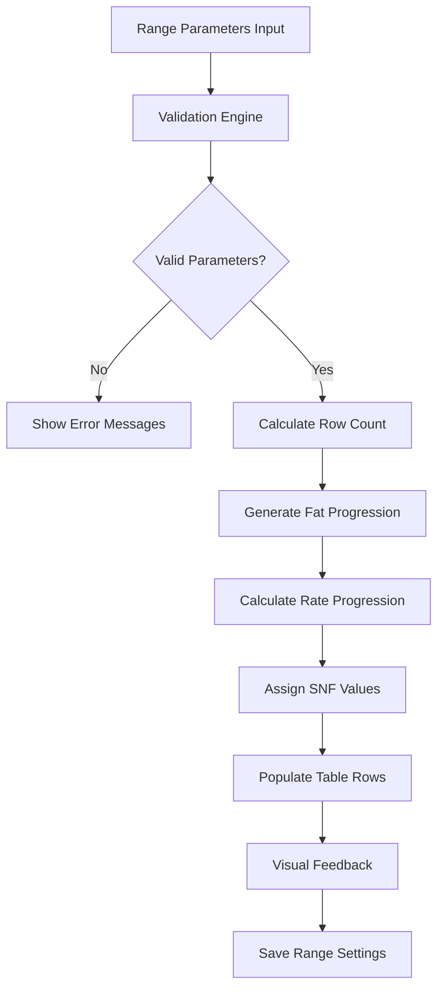

# Design Document

## Overview

This design enhances the existing Advanced Rate Chart system with intelligent auto-fill capabilities. When users enter range parameters (start fat, end fat, base rate, difference), the system will automatically calculate and populate all rows in both cow and buffalo milk rate tables, significantly improving efficiency and reducing manual data entry errors.

## Architecture

### Component Structure

```
MilkRateChart Component
├── Range Input Section (existing)
├── Auto-Fill Engine (new)
├── Cow Milk Table (enhanced)
├── Buffalo Milk Table (enhanced)
└── Preview & Validation (new)
```

### Auto-Fill Engine Architecture



## Components and Interfaces

### Auto-Fill Engine Interface

```typescript
interface AutoFillEngine {
  calculateRows(params: RangeParameters): CalculatedRow[]
  validateParameters(params: RangeParameters): ValidationResult
  generateFatProgression(start: number, end: number, rowCount: number): number[]
  calculateRateProgression(baseRate: number, difference: number, rowCount: number): number[]
  assignSnfValues(milkType: 'cow' | 'buffalo', rowCount: number, startSnf?: number): number[]
}

interface RangeParameters {
  startFat: number
  endFat: number
  baseRate: number
  difference: number
  startSnf?: number
  endSnf?: number
}

interface CalculatedRow {
  id: number
  fat: number
  snf: number
  rate: number
}

interface ValidationResult {
  isValid: boolean
  errors: string[]
  warnings: string[]
}
```

### Enhanced State Management

```typescript
interface RateChartState {
  // Existing state
  cowRows: CalculatedRow[]
  buffaloRows: CalculatedRow[]
  rangeData: RangeParameters
  
  // New auto-fill state
  autoFillInProgress: boolean
  previewData: {
    cow: CalculatedRow[]
    buffalo: CalculatedRow[]
  }
  lastAppliedRange: RangeParameters | null
  validationErrors: string[]
  showPreview: boolean
}
```

## Data Models

### Enhanced Range Settings Schema

```javascript
const rangeSettingsSchema = new mongoose.Schema({
  startFat: { type: Number, required: true, min: 0, max: 10 },
  endFat: { type: Number, required: true, min: 0, max: 10 },
  baseRate: { type: Number, required: true, min: 0 },
  difference: { type: Number, required: true, min: 0 },
  startSnf: { type: Number, default: 8.5, min: 0, max: 15 },
  endSnf: { type: Number, default: 9.0, min: 0, max: 15 },
  snfRange: { type: String, default: "" },
  
  // New auto-fill settings
  autoFillEnabled: { type: Boolean, default: true },
  rowGenerationMethod: { type: String, enum: ['fixed', 'dynamic'], default: 'dynamic' },
  maxRows: { type: Number, default: 20, min: 1, max: 50 },
  lastAppliedAt: { type: Date, default: Date.now }
}, { _id: false });
```

## Correctness Properties

*A property is a characteristic or behavior that should hold true across all valid executions of a system-essentially, a formal statement about what the system should do. Properties serve as the bridge between human-readable specifications and machine-verifiable correctness guarantees.*

### Property Reflection

After analyzing all acceptance criteria, I identified several areas where properties can be consolidated:
- Properties 1.2 and 1.3 (Apply to Cow/Buffalo) can be combined into a single property about milk type-specific auto-fill
- Properties 3.1 and 3.2 (rate calculations) can be combined into a comprehensive rate calculation property
- Properties 4.1 and 4.2 (SNF assignment) can be combined into a milk type-specific SNF property
- Properties 6.1 and 6.2 (save/load range parameters) can be combined into a persistence round-trip property

### Core Auto-Fill Properties

**Property 1: Auto-fill trigger validation**
*For any* set of range parameters, auto-fill should only trigger when all required parameters (start fat, end fat, base rate, difference) are provided and valid
**Validates: Requirements 1.1, 1.4**

**Property 2: Milk type-specific auto-fill**
*For any* milk type (cow or buffalo), applying auto-fill should populate all rows with calculated values specific to that milk type's pricing rules
**Validates: Requirements 1.2, 1.3**

**Property 3: Dynamic row management**
*For any* fat range, the system should generate the optimal number of rows based on 0.1% increments while respecting minimum (1) and maximum (50) row limits
**Validates: Requirements 2.1, 2.2, 2.3, 2.4**

**Property 4: Progressive rate calculation**
*For any* valid range parameters, calculated rates should progress correctly: cow milk using base rate + (difference × fat_increment), buffalo milk using (base_rate + 15) + (2.5 × fat_increment)
**Validates: Requirements 3.1, 3.2**

**Property 5: Fat distribution accuracy**
*For any* start and end fat values, fat percentages should be distributed evenly across all rows from start to end with proper decimal rounding (1 decimal place)
**Validates: Requirements 3.3, 3.4**

**Property 6: SNF assignment by milk type**
*For any* milk type, SNF values should start at the appropriate default (cow: 8.5%, buffalo: 9.0%) or custom start value and increment by 0.1% per row
**Validates: Requirements 4.1, 4.2, 4.3, 4.4**

**Property 7: Real-time preview accuracy**
*For any* range parameter changes, the preview should show accurate first and last calculated values before auto-fill is applied
**Validates: Requirements 5.1**

**Property 8: Validation error handling**
*For any* invalid input combination (start fat > end fat, negative base rate, parameters causing negative rates), appropriate error messages should be displayed and auto-fill prevented
**Validates: Requirements 7.1, 7.2, 7.3**

**Property 9: Range parameter persistence**
*For any* rate chart with applied auto-fill, saving and then loading the chart should restore the same range parameters
**Validates: Requirements 6.1, 6.2**

**Property 10: Performance constraint**
*For any* auto-fill operation, calculations should complete within 500 milliseconds regardless of the number of rows being populated
**Validates: Requirements 8.1**

**Property 11: UI state management**
*For any* auto-fill operation in progress, form inputs should be disabled and visual feedback should be provided until completion
**Validates: Requirements 8.3, 8.4**

## Error Handling

### Validation Errors
- **Invalid Fat Range**: Start fat must be less than end fat
- **Invalid Base Rate**: Base rate must be positive
- **Negative Rate Warning**: Alert when calculations would result in negative rates
- **Row Limit Exceeded**: Prevent generation of more than 50 rows
- **Missing Parameters**: Require all essential parameters before auto-fill

### Recovery Mechanisms
- **Undo Functionality**: Allow reverting auto-filled values to previous state
- **Parameter Preservation**: Maintain user inputs during network errors
- **Graceful Degradation**: Fall back to manual entry if auto-fill fails
- **Retry Options**: Provide retry mechanisms for failed operations

### User Feedback
- **Progress Indicators**: Show progress for operations taking >200ms
- **Visual Highlights**: Temporarily highlight populated rows
- **Error Messages**: Clear, actionable error messages with guidance
- **Success Confirmations**: Confirm successful auto-fill operations

## Testing Strategy

### Unit Testing Approach
- **Calculation Engine Tests**: Verify mathematical accuracy of rate and fat calculations
- **Validation Logic Tests**: Test all input validation scenarios
- **Row Management Tests**: Test dynamic row addition/removal
- **State Management Tests**: Verify UI state changes during operations

### Property-Based Testing Configuration
- **Test Framework**: Jest with fast-check for property-based testing
- **Minimum Iterations**: 100 iterations per property test
- **Test Data Generation**: Smart generators for valid range parameters
- **Performance Testing**: Measure calculation times under various loads

### Integration Testing
- **End-to-End Workflows**: Test complete auto-fill workflows
- **API Integration**: Test backend integration for saving/loading
- **UI Interaction Tests**: Test button clicks and form interactions
- **Error Scenario Tests**: Test network failures and recovery

### Property Test Examples

```javascript
// Property 4: Progressive rate calculation
test('Rate calculation property', () => {
  fc.assert(fc.property(
    fc.record({
      startFat: fc.float({ min: 3.0, max: 6.0 }),
      endFat: fc.float({ min: 6.1, max: 8.0 }),
      baseRate: fc.float({ min: 30.0, max: 80.0 }),
      difference: fc.float({ min: 1.0, max: 5.0 })
    }),
    (params) => {
      const cowRows = calculateCowRates(params);
      const buffaloRows = calculateBuffaloRates(params);
      
      // Verify cow rate progression
      for (let i = 1; i < cowRows.length; i++) {
        const expectedIncrease = params.difference * 
          ((cowRows[i].fat - cowRows[i-1].fat) / 0.1);
        const actualIncrease = cowRows[i].rate - cowRows[i-1].rate;
        expect(Math.abs(actualIncrease - expectedIncrease)).toBeLessThan(0.01);
      }
      
      // Verify buffalo premium and increment
      expect(buffaloRows[0].rate).toBeGreaterThan(cowRows[0].rate + 14.9);
    }
  ));
});
```

This comprehensive testing approach ensures the auto-fill functionality is reliable, performant, and user-friendly while maintaining mathematical accuracy in all calculations.

<function_calls>
<invoke name="prework">
<parameter name="featureName">rate-chart-auto-fill