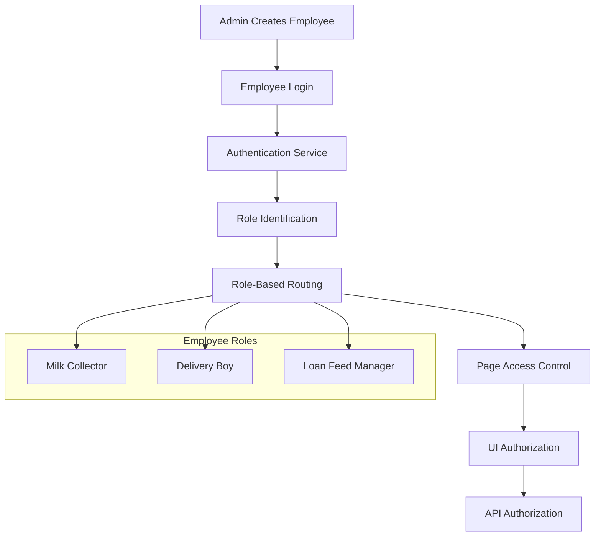

# Design Document: Role-Based Employee Authentication System

## Overview

This design document outlines a comprehensive role-based employee authentication and authorization system for the dairy management platform. The system implements strict access controls where employees can only access pages and perform actions appropriate to their assigned roles, with multi-level security enforcement.

The system supports three distinct employee roles:
- **Milk Collector**: Full page access with limited modification permissions
- **Delivery Boy**: Restricted to delivery requests page only
- **Loan & Feed Manager**: Access limited to loan and feed management functions

## Architecture

### High-Level Architecture



### Security Layers

The system implements defense-in-depth with three security layers:

1. **UI Layer**: Hide/disable unauthorized elements
2. **Route Layer**: Protected route components with role validation
3. **API Layer**: Backend middleware validation for all requests

## Components and Interfaces

### 1. Authentication Components

#### Employee Login Form
```typescript
interface EmployeeLoginForm {
  mobile: string;
  password: string;
  role: EmployeeRole;
}

enum EmployeeRole {
  MILK_COLLECTOR = 'milk_collector',
  DELIVERY_BOY = 'delivery_boy',
  LOAN_FEED_MANAGER = 'loan_feed_manager'
}
```

#### Authentication Service
```typescript
interface AuthenticationService {
  loginEmployee(credentials: EmployeeLoginForm): Promise<AuthResult>;
  validateToken(token: string): Promise<TokenValidation>;
  logout(): void;
}

interface AuthResult {
  success: boolean;
  token?: string;
  employee?: EmployeeProfile;
  redirectPath?: string;
  error?: string;
}
```

### 2. Authorization Components

#### Role-Based Route Guard
```typescript
interface RoleGuard {
  canAccess(route: string, role: EmployeeRole): boolean;
  getRedirectPath(role: EmployeeRole): string;
  validatePageAccess(page: string, role: EmployeeRole): AccessResult;
}

interface AccessResult {
  allowed: boolean;
  reason?: string;
  redirectTo?: string;
}
```

#### Permission Manager
```typescript
interface PermissionManager {
  canViewPage(page: string, role: EmployeeRole): boolean;
  canModifyData(action: string, role: EmployeeRole): boolean;
  getAuthorizedActions(role: EmployeeRole): string[];
}
```

### 3. UI Components

#### Warning Popup Component
```typescript
interface WarningPopup {
  message: string;
  onOk: () => void;
  onClose: () => void;
  redirectPath?: string;
}
```

#### Role-Based Navigation
```typescript
interface RoleBasedNavigation {
  getVisibleMenuItems(role: EmployeeRole): MenuItem[];
  getEnabledActions(page: string, role: EmployeeRole): Action[];
}
```

## Data Models

### Employee Model
```typescript
interface Employee {
  id: string;
  mobile: string;
  password: string; // bcrypt hashed
  role: EmployeeRole;
  isActive: boolean;
  isApproved: boolean;
  createdBy: string; // Admin ID
  createdAt: Date;
  updatedAt: Date;
}
```

### Authentication Token
```typescript
interface AuthToken {
  employeeId: string;
  role: EmployeeRole;
  mobile: string;
  issuedAt: number;
  expiresAt: number;
}
```

### Role Permissions Matrix
```typescript
interface RolePermissions {
  [EmployeeRole.MILK_COLLECTOR]: {
    pages: ['*']; // All employee pages
    restrictions: {
      'delivery-requests': ['edit', 'approve', 'modify'];
    };
  };
  [EmployeeRole.DELIVERY_BOY]: {
    pages: ['delivery-requests'];
    restrictions: {};
  };
  [EmployeeRole.LOAN_FEED_MANAGER]: {
    pages: ['loan-management', 'feed-management'];
    restrictions: {};
  };
}
```

## Correctness Properties

*A property is a characteristic or behavior that should hold true across all valid executions of a system-essentially, a formal statement about what the system should do. Properties serve as the bridge between human-readable specifications and machine-verifiable correctness guarantees.*

<function_calls>
<invoke name="prework">
<parameter name="featureName">role-based-employee-auth

### Property 1: Employee Creation Validation
*For any* employee creation request, all required fields (mobile number, password, and employee role) must be present and valid before the employee account is created.
**Validates: Requirements 1.1**

### Property 2: Employee ID Uniqueness
*For any* set of employee accounts, all generated employee IDs must be unique across the entire system.
**Validates: Requirements 1.2**

### Property 3: Role Validation
*For any* employee role assignment, the role must be one of the allowed values (milk_collector, delivery_boy, loan_feed_manager) or the assignment must be rejected.
**Validates: Requirements 1.3**

### Property 4: Mobile Number Uniqueness
*For any* employee creation attempt, if the mobile number already exists in the system, the creation must be rejected.
**Validates: Requirements 1.4**

### Property 5: Password Security
*For any* employee account, the stored password must be bcrypt hashed with salt rounds ≥ 10, never stored in plain text.
**Validates: Requirements 1.5, 9.2**

### Property 6: Login Field Validation
*For any* login attempt, all required fields (mobile number, password, role selection) must be provided or the login must be rejected.
**Validates: Requirements 2.1**

### Property 7: Account Status Validation
*For any* login attempt, the employee account must be both active and approved, or the login must be rejected.
**Validates: Requirements 2.2, 9.4**

### Property 8: Role-Based Redirection
*For any* successful employee login, the system must redirect to the role-specific landing page without requiring manual page selection.
**Validates: Requirements 2.4, 3.4**

### Property 9: Token Role Storage
*For any* successful authentication, the generated token must contain the employee's role information.
**Validates: Requirements 3.5**

### Property 10: Milk Collector Page Access
*For any* milk collector employee, access to any employee page must be allowed for viewing purposes.
**Validates: Requirements 4.1**

### Property 11: Milk Collector Action Restrictions
*For any* milk collector attempting to edit or approve delivery requests, the action must be prevented and a warning popup displayed.
**Validates: Requirements 4.3, 4.4**

### Property 12: Delivery Boy Page Restrictions
*For any* delivery boy attempting to access pages other than delivery requests, access must be prevented and a warning popup displayed.
**Validates: Requirements 5.2**

### Property 13: Unauthorized Content Prevention
*For any* unauthorized page access attempt, the page content must not be loaded and the user must be redirected to an authorized area.
**Validates: Requirements 5.5**

### Property 14: Loan Feed Manager Access Restrictions
*For any* loan feed manager attempting to access milk collection or delivery request pages, access must be prevented and a warning popup displayed.
**Validates: Requirements 6.3, 6.4**

### Property 15: Multi-Layer Authorization
*For any* system operation, authorization must be enforced at UI, route, and API levels independently.
**Validates: Requirements 7.1, 7.2, 7.3**

### Property 16: Backend Authorization Independence
*For any* request, backend authorization validation must occur regardless of frontend authorization state.
**Validates: Requirements 7.4, 9.5**

### Property 17: Authorization Error Codes
*For any* failed backend authorization, appropriate HTTP error codes must be returned.
**Validates: Requirements 7.5**

### Property 18: Warning Popup Behavior
*For any* unauthorized access attempt, a professional warning popup must be displayed with appropriate messaging.
**Validates: Requirements 8.1**

### Property 19: Safe Redirection
*For any* warning popup dismissal, the system must redirect to a safe, authorized page without crashes or blank screens.
**Validates: Requirements 8.4, 8.5, 10.3**

### Property 20: Role Modification Prevention
*For any* employee, attempts to change their own role must be prevented by the system.
**Validates: Requirements 9.3, 10.4**

### Property 21: UI Element Authorization
*For any* employee viewing the interface, unauthorized menu items and buttons must be hidden or disabled based on their role.
**Validates: Requirements 10.1, 10.2**

## Error Handling

### Authentication Errors
- **Invalid Credentials**: Display clear error message, do not reveal which field is incorrect
- **Inactive Account**: Display message "Account is inactive. Contact administrator."
- **Unapproved Account**: Display message "Account pending approval. Contact administrator."
- **Invalid Role**: Display message "Invalid role selected for this account."

### Authorization Errors
- **Unauthorized Page Access**: Display role-specific warning popup and redirect
- **Unauthorized Action**: Display action-specific warning popup and prevent action
- **API Authorization Failure**: Return HTTP 403 with appropriate error message
- **Token Validation Failure**: Clear session and redirect to login

### System Errors
- **Database Connection**: Display generic error message, log detailed error
- **Token Expiration**: Clear session and redirect to login with expiration message
- **Network Errors**: Display retry option with appropriate messaging

## Testing Strategy

### Dual Testing Approach
The system will be validated using both unit tests and property-based tests:

- **Unit Tests**: Verify specific examples, edge cases, and error conditions
- **Property Tests**: Verify universal properties across all inputs using randomized testing

### Property-Based Testing Configuration
- **Framework**: Jest with fast-check for JavaScript/TypeScript
- **Test Iterations**: Minimum 100 iterations per property test
- **Test Tagging**: Each property test tagged with format: **Feature: role-based-employee-auth, Property {number}: {property_text}**

### Unit Testing Focus Areas
- Specific role-based redirection examples
- Warning popup message content validation
- Error handling scenarios
- Integration between authentication and authorization components

### Property Testing Focus Areas
- Universal authorization rules across all roles
- Input validation across all employee creation scenarios
- Security enforcement across all access attempts
- Token validation across all authentication scenarios

### Test Coverage Requirements
- All correctness properties must have corresponding property-based tests
- All error conditions must have unit tests
- All role-specific behaviors must have integration tests
- All security layers must be independently tested